# EDINET API 仕様書

（Version 2）

2026 年 4 月 金融庁 企画市場局 企業開示課

---

**◆ Microsoft Corporation のガイドラインに従って画面写真を使用しています。**

**◆ Microsoft、Windows は、米国 Microsoft Corporation の米国及びその他の国における登録商標又は商標です。**

**◆ その他、記載されている会社名及び製品名は、各社の登録商標又は商標です。**

**◆ 本文中では、TM、®、©は省略しています。**

**◆ 本文及び添付のデータファイルで題材として使用している個人名、団体名、商品名、ロゴ、連絡先、メールアドレス、 場所、出来事等は、全て架空のものです。実在するものとは一切関係ありません。**

**◆ 本書に掲載されている内容は、2026 年 4 月現在のもので、予告なく変更される可能性があります。**

**◆ 本書で公開している情報の利用については、利用規約（ https://disclosure2dl.edinet-fsa.go.jp/guide/static/disclosure/WZEK0030.html ）を遵守してください。**

**◆ 本書に記載の会社名及び製品名について、金融庁はそれらの会社、製品等を推奨するものではありません。**

Copyright © 金融庁 All Rights Reserved.

# 目次

## 1 章 概要

- 1-1 EDINET API とは

- 1-2 EDINET API の機能

- 1-2-1 EDINET API の機能概要

- 1-2-2 EDINET API で取得対象となるデータの範囲

## 2 章 API の利用準備

- 2-1 利用環境について

- 2-2 ポップアップ許可サイトへの追加

- 2-2-1 ポップアップブロックの許可

- 2-3 アカウントの作成と API キーの発行について

- 2-3-1 アカウントの作成について

- 2-3-1-1 サインイン画面の表示

- 2-3-1-2 アカウントの作成

- 2-3-2 API キーの発行／連絡先の変更／API キーの削除

- 2-3-2-1 API キーの発行

- 2-3-2-2 連絡先の変更及び API キーの再発行

- 2-3-2-3 API キーの削除

- 2-3-2-4 パスワードの再発行

- 2-3-2-5 多要素認証のクリア

## 3 章 インターフェース仕様

- 3-1 書類一覧 API

- 3-1-1 リクエストについて

- 3-1-2 レスポンスについて

- 3-1-2-1 書類一覧 API（メタデータ）

- 3-1-2-2 書類一覧 API（提出書類一覧及びメタデータ）

- 3-1-3 メタデータ及び提出書類一覧の更新タイミング

- 3-1-3-1 更新対象となるデータ

- 3-1-3-2 当日分のデータ更新タイミング

- 3-1-3-3 過去分のデータ更新タイミング

- 3-1-4 閲覧期間の満了

- 3-1-5 書類の取下げ

- 3-1-6 財務局職員による書類情報修正

- 3-1-7 財務局職員による書類の不開示

- 3-1-8 提出者情報の変更について

- 3-1-8-1 EDINET コードに紐づく提出者の属性情報変更

- 3-1-8-2 EDINET コード自体の変更

- 3-1-9 運用開始時及び 2023 年 1 月 4 日のシステム更改にともなう対応について

- 3-2 書類取得 API

- 3-2-1 リクエストについて

- 3-2-2 レスポンスについて

- 3-3 ステータスコード

## 4 章 その他

- 4-1 参考資料

# 本書について

本書は、有価証券報告書等の開示書類に関する電子開示システム（EDINET）が提供するWeb-API（以下「EDINET API」という。）のインターフェース仕様について記載しています。

#### 本書の表記について

本書内に記載している記号は、次のような意味があります。

| 表示 | 意味 |
| :--- | :--- |
| [!NOTE] | 知っておいていただきたいことについて説明しています。 |
| [!CAUTION] | 注意事項について説明しています。必ずお読みください。 |
| REFERENCE | 参照先をさします。 例： 「1-1 EDINET API とは」 |

#### 添付ドキュメントについて

本書に添付されるドキュメントは、次のとおりです。

| 添付ドキュメント名 | ドキュメント概要 |
| :--- | :--- |
| 別紙 1 様式コードリスト | 様式コードに関する一覧です。 |
| 別紙 2 提出書類一覧のデータ出力例 | 書類一覧 API の出力内容について、特徴的なケースごとの例です。 |

---

# 1 章 概要

## 1-1 EDINET API とは

EDINET API の概要について説明します。

EDINET API は、利用者が EDINET の画面からではなく、プログラムを介して EDINET のデータベースから効率的にデータを取得できる API（アプリケーション・プログラミング・インターフェース）です。EDINET API により、EDINET 利用者は効率的に開示情報を取得することが可能となります。

### EDINET API 全体図（イメージ）

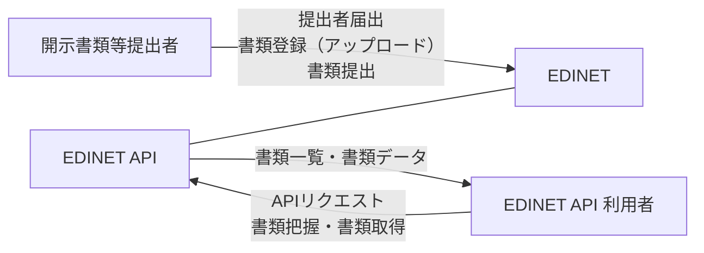
```mermaid
flowchart LR
    SUBMITTER["開示書類等提出者"]
    EDINET["EDINET"]
    API["EDINET API"]
    USER["EDINET API 利用者"]

    SUBMITTER -->|提出者届出<br/>書類登録（アップロード）<br/>書類提出| EDINET
    USER -->|APIリクエスト<br/>書類把握・書類取得| API
    API -->|書類一覧・書類データ| USER
    API --- EDINET
```

## 1-2 EDINET API の機能

EDINET API の機能の全体像について説明します。

### 1-2-1 EDINET API の機能概要

EDINET は、次の 2 つの API を提供します。

1. **提出された書類を把握するための API**

EDINET に提出された書類の一覧を取得する API（以下「書類一覧 API」という。）で、日付ごとに提出書類情報、書類情報修正情報等を把握することが可能です。書類一覧 API では、「メタデータのみ」又は「提出書類一覧及びメタデータ」を取得することができます（「メタデータ」とは日付ごとの提出書類一覧に関する基礎情報のことで、件数、更新日時等を含みます。詳細は、「REFERENCE 3-1-2-1 書類一覧 API（メタデータ）」を参照してください。）。

2. **提供された書類を取得するための API**

EDINET に提出された書類を取得する API（以下「書類取得 API」という。）で、リクエストパラメータにより取得する書類の種類を指定することが可能です。

EDINET API の基本的な利用方法について説明します。

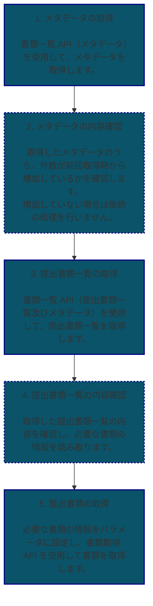
```mermaid
flowchart TB
    S1["1. メタデータの取得<br/><br/>書類一覧 API（メタデータ）を使用して、メタデータを取得します。"]
    S2["2. メタデータの内容確認<br/><br/>取得したメタデータのうち、件数が前回取得時から増加しているかを確認します。<br/>増加していない場合は後続の処理を行いません。"]
    S3["3. 提出書類一覧の取得<br/><br/>書類一覧 API（提出書類一覧及びメタデータ）を使用して、提出書類一覧を取得します。"]
    S4["4. 提出書類一覧の内容確認<br/><br/>取得した提出書類一覧の内容を確認し、必要な書類の情報を読み取ります。"]
    S5["5. 提出書類の取得<br/><br/>必要な書類の情報をパラメータに設定し、書類取得 API を使用して書類を取得します。"]

    S1 --> S2 --> S3 --> S4 --> S5

    style S1 fill:#0B5369,stroke:#000080,stroke-width:2px
    style S2 fill:#0B5369,stroke:#000080,stroke-width:2px,stroke-dasharray:3 3
    style S3 fill:#0B5369,stroke:#000080,stroke-width:2px
    style S4 fill:#0B5369,stroke:#000080,stroke-width:2px,stroke-dasharray:3 3
    style S5 fill:#0B5369,stroke:#000080,stroke-width:2px
```

### 1-2-2 EDINET API で取得対象となるデータの範囲

EDINET API は縦覧期間及び延長期間にある書類を取得対象とします。縦覧期間は、書類種別ごとに金融商品取引法に定められていますが、一部の書類は、縦覧期間経過後も一定期間（以下「延長期間」という。）は EDINET において閲覧可能です。この縦覧期間と延長期間を合わせた閲覧可能な期間を「閲覧期間」と呼びます。

延長期間が設けられる書類については、次の表を参照してください。縦覧期間及び延長期間は年単位で定められ、当該年数を経過した日が財務局の休日（土日、祝日及び 12 月 29 日から翌年の 1 月 3 日までの日（行政機関の休日に関する法律に定める休日））に当たる場合、縦覧期間（又は延長期間）の満了日は、翌営業日（休日でない日）まで繰り下げられます。

#### 延長期間

延長期間が設けられる書類並びに書類種別ごとの縦覧期間、延長期間及び閲覧期間は次のとおりです。

| 府令 | 書類種別 | 縦覧期間 (a) | 延長期間 (b) | 閲覧期間 (a+b) |
| :--- | :--- | :--- | :--- | :--- |
| 企業内容等の開示に関する内閣府令 | 有価証券報告書 | 5 年 | 5 年 | 10 年 |
| | 半期報告書 | 5 年 | 5 年 | 10 年 |
| | 四半期報告書 | 3 年 | 7 年 | 10 年 |

> [!CAUTION] **延長期間について**

> - 半期報告書については、2024 年（令和 6 年）4 月 1 日以後提出の書類が延長期間の対象。四半期報告書については、 2015 年（平成 27 年）4 月 1 日以後提出の書類が延長期間の対象。なお、特定有価証券の有価証券報告書等については、従来どおり延長期間は設けられません。

> - 延長期間中の書類は、法定縦覧期間満了後も一定期間、行政サービスの位置づけで閲覧を可能とした書類であるため、提出会社による記載内容の訂正（訂正書類を提出すること。）が、法定縦覧期間内の開示書類と同様には行われないことがあります。

# 2 章 API の利用準備

## 2-1 利用環境について

EDINET API を利用する場合の、コンピュータ環境について説明します。

#### EDINET API の利用環境

EDINET API を利用する際は、製品サポートが継続しているオペレーティングシステムや Web ブラウザ等を利用ください。製品サポートのないオペレーティングシステムや Web ブラウザ等では、EDINET API を利用できない場合があります。

## 2-2 ポップアップ許可サイトへの追加

EDINET API 利用のためのアカウントを作成する前に、御利用いただくコンピュータに事前準備が必要です。事前準備の手順について説明します。

ご利用いただくコンピュータに、ポップアップブロックの許可設定を行います。本項では、設定の手順について説明します。

#### ポップアップ許可サイトへの追加設定の目的

次項で説明する API キー発行画面及び API キー削除画面へアクセスする際に必要となります。

初回のポップアップブロック許可設定後、API キー発行画面及び API キー削除画面は、継続して利用可能です。

## 2-2-1 ポップアップブロックの許可

Microsoft Edge ブラウザを起動し、Microsoft Edge の設定画面から、ポップアップ許可サイトへの追加設定を行います。

### Microsoft Edge の起動

タスクバーの Windows アイコンをクリックします。


「すべて」をクリックします。

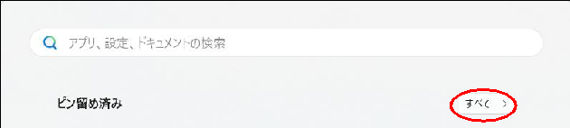

《Microsoft Edge》を起動します。

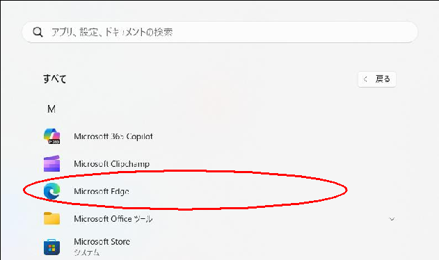

### 設定画面の表示

起動した Microsoft Edge 画面右上の《･･･》をクリックします。

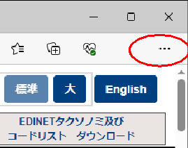

表示されたメニューから「設定」をクリックし設定画面を表示します。

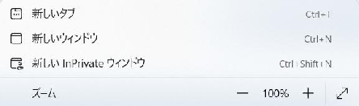

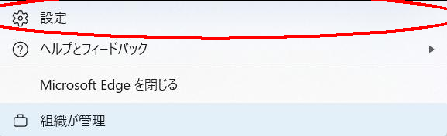

### プライバシー、検索、サービスの表示

表示された設定画面左上の「設定」をクリックし、設定メニューを表示します。表示されたメニューから「プライバシー、検索、サービス」をクリックします。

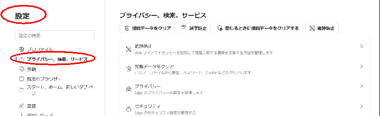

### ポップアップ許可サイトの追加

「プライバシー、検索、サービス」をクリックすると、右側にメニューが表示されますので、「サイトのアクセス許可」をクリックします。

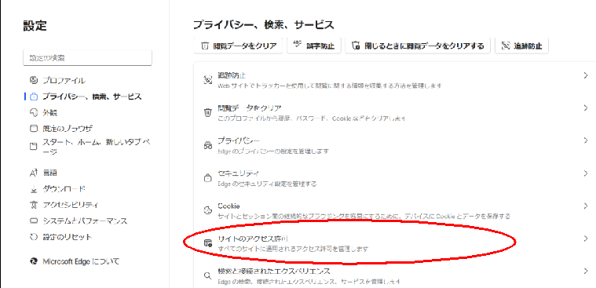

「サイトのアクセス許可」をクリックし、表示されたメニューから、「ポップアップとリダイレクト」をクリックします。

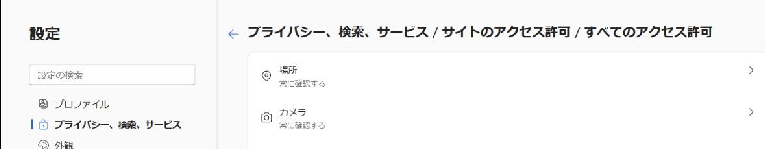

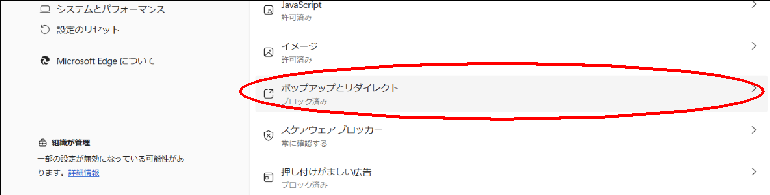

「ポップアップとリダイレクト許可」設定の画面が表示されます。「ポップアップの送信とリダイレクトの使用を許可しました」欄の「サイトの追加」ボタンをクリックし、「サイトの追加」画面を表示します。

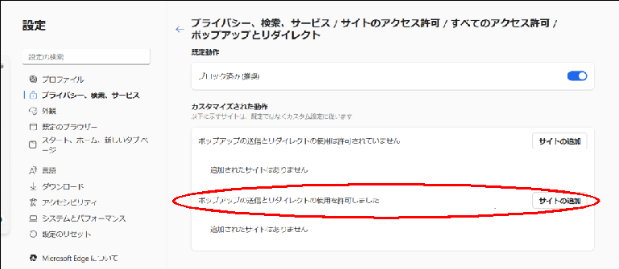

「サイトの追加」画面で「 https://api.edinet-fsa.go.jp 」を入力し、「追加」ボタンをクリックします。

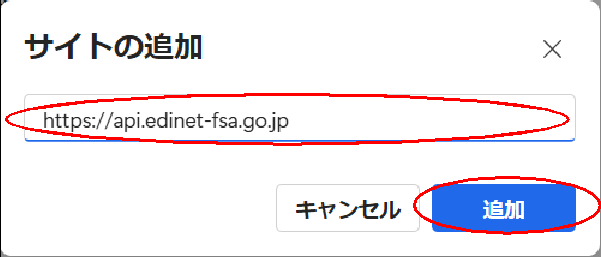

入力したサイト「 https://api.edinet-fsa.go.jp 」が「許可」欄に追加表示されたことで、「 https://api.edinet-fsa.go.jp 」がポップアップ許可サイトとなります。

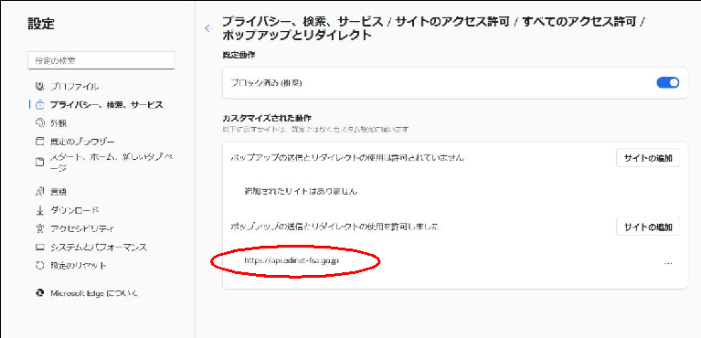

ブラウザのタブの「×」ボタンをクリックし、設定操作を終了します。

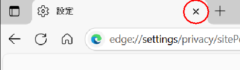

## 2-3 アカウントの作成と API キーの発行について

認証を含む EDINET API への接続仕様について説明します。

EDINET API への接続の際には、EDINET から発行されたキー（以下「API キー」という。）を使用した認証を行います。API キーの取得に際しては、アカウントの作成が必要となります。

本項では、アカウントを作成する方法及び EDINET API の認証に必要な API キーの取得方法について説明します。

#### アカウントの利用目的

作成するアカウントは API キー発行画面へアクセスする際に必要となります。

EDINET API へのアクセスは初回アクセス時に発行した API キーを継続して利用可能です。

## 2-3-1 アカウントの作成について

EDINET API のアカウント作成について説明します。

### 2-3-1-1 サインイン画面の表示

アカウントを作成する場合は、EDINET の［閲覧サイト］に接続し、「ログイン」ボタンをクリックしてサインイン画面を表示します。

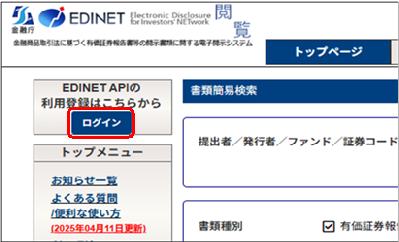

### 2-3-1-2 アカウントの作成

以下に示す手順に従い、アカウントを作成します。

#### サインアップ画面の表示

サインイン画面で「今すぐサインアップ」のリンクをクリックし、サインアップ画面を表示します。

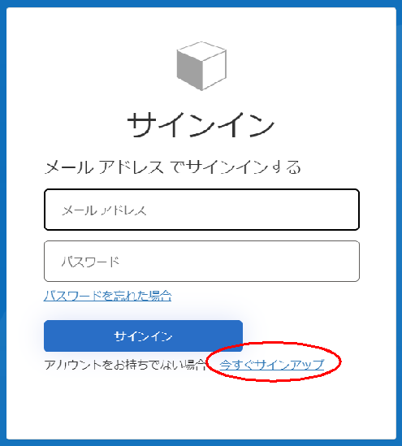

*(出典：Microsoft Corporation)*

#### 確認コードの送信

表示されたサインアップ画面で最上部の入力欄にメールアドレスを入力し、「ボットを倒すお手伝いをします」の下に表示された画像認証の文字を二番目の入力欄に入力します。「確認コードを送信」をクリックすると、入力したメールアドレスに確認コードが記載されたメールが届きます。

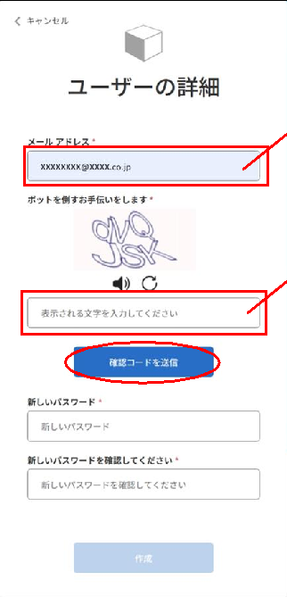

 メールアドレス入力欄

 画像認証入力欄

*(出典：Microsoft Corporation)*

-  は読み上げられる単語を入力する認証方式に切り替える場合に使用します。

-  をクリックすることで画像に表示された文字を入力する認証方式に戻ります。

-  は画像または読み上げられる単語を更新する場合に使用します。

> [!CAUTION] **確認コードが届かない場合**

> 以下をご確認ください。

> - 入力したメールアドレスが正しいかどうかをご確認ください。

> - Microsoft アカウントからのメールが「迷惑メール」に入っていないか確認して、送信されたコードをお使いください。有効な確認コードは、「@microsoftonline.com」のメールアドレスから送られてきます。確認コードを受信トレイに受信するには、信頼された差出人として「@microsoftonline.com」を設定してください。

> - スマートフォンや携帯電話でメールを受信される場合は、通信環境の良いところで受信してください。

#### コードの確認

メールにて受信した確認コードを確認コード入力欄に入力し、「コードの確認」をクリックします。

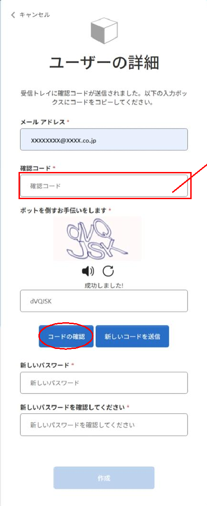

*(出典：Microsoft Corporation)*

※「新しいコードを送信」は確認コードを再送する場合に使用します。

#### アカウントの作成

コードの確認後、パスワード入力欄及びパスワード確認欄に、同一のパスワードを入力してください。なお、パスワードについては、パスワードポリシー（下記NOTE参照）に従って設定してください。パスワード入力後、「作成」ボタンをクリックするとアカウントが作成され、多要素認証画面が表示されます。

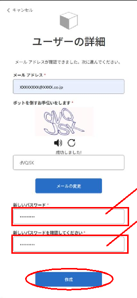

*(出典：Microsoft Corporation)*

※「メールの変更」はアカウントの作成中に登録するメールアドレスの変更を行いたい場合に使用します。今回のアカウント作成の流れにおいては使用しません。

> [!NOTE] **パスワードポリシーについて**

> アカウント登録時のパスワードポリシー（パスワード入力時の制限事項）を以下に示します。

> 1. **使用可能な文字** 英数字：A～Z、a～z、0～9 記号：`@ # $ % ^ & * - _ ! + = [ ] { } | \ : ' , . ? / ` ~ " ( ) ;`、空白

> 2. **文字数** 12 文字以上 256 文字以内

> 3. **文字種** 小文字、大文字、数字、記号のうち 3 つ以上が必要

> 4. **変更時の制限** パスワードを変更する場合、前回のパスワードを再度使用することはできません。

#### 多要素認証の登録

多要素認証は、以下のいずれかの方式が選択できます。

（１）SMS による本人確認

SMSにて通知される確認コードを多要素認証確認コード入力画面に入力することにより多要素認証を行う方式です。

（２）自動音声による本人確認

登録した電話番号に発信される自動音声通話を受け取り、音声ガイダンスに従い、テンキーで「#」を入力することにより多要素認証を行う方式です。

いずれの方式においても、まずは、以下に示す画面に「国コード」及び「電話番号」を入力します。次に、SMS による本人確認を行う場合は「コードの送信」、自動音声による本人確認を行う場合は「電話する」をクリックします（「電話する」をクリックすると、入力した電話番号に自動音声通話を送信します。）。

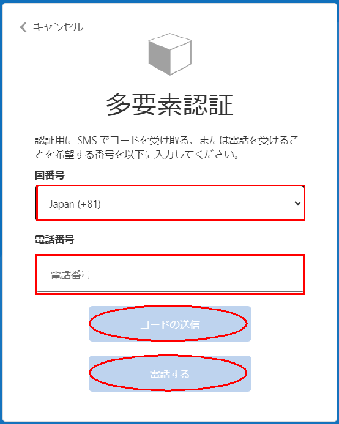

(出典：Microsoft Corporation)

#### 確認コードの入力

SMS にて受け取った確認コードを入力します。確認コードを入力し、エンターキー を押すと API キー発行画面が表示されます。API キー発行画面の操作は「2-3-2-1 API キーの発行」を参照してください。

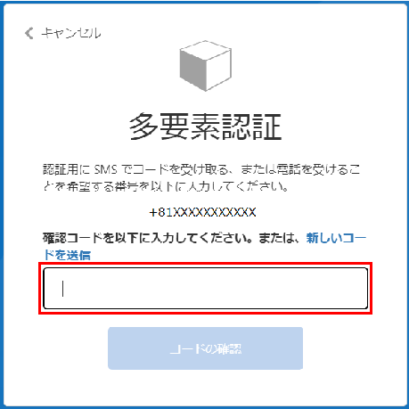

*(出典：Microsoft Corporation)*

以上でアカウントの作成は完了です。続けて API キーの発行を行ってください。

## 2-3-2 API キーの発行／連絡先の変更／API キーの削除

### 2-3-2-1 API キーの発行

多要素認証でのサインイン後に表示される API キー発行画面で連絡先を登録することになります。

|№|項目名|項目 ID|型|文字種|桁数|説明|
|---|---|---|---|---|---|---|
|1|メタデータ|metadata|object|－|－|メタデータの識別子です。|
|2|タイトル|title|string|全半角|18|API の名称が出力されます。|
|3|パラメータ|parameter|object|－|－|リクエストパラメータの識別子です。|
|4|ファイル日付|date|string (YYYY-MM-DD 形式)|半角|10|指定したファイル日付が出力されます。|
|5|取得情報|type|string|半角|1|指定した取得情報が出力されます。|
|6|結果セット|resultset|object|－|－|結果セットの識別子です。|
|7|件数|count|number|半角|5 以下|指定したファイル日付における提出書類一覧の件数が出力されます。|
|8|書類一覧更新日時|processDateTime|string (YYYY-MM-DD hh:mm 形式)|半角|16|提出書類一覧の更新時間が出力されます。提出書類一覧の内容に変更がない場合でも書類一覧更新日時は更新されます。|
|9|ステータス|status|string|半角|3|「3-3 ステータスコード」に記載のステータスが出力されます（リクエスト成功時は「200」）。|
|10|メッセージ|message|string|半角|21 以下|「3-3 ステータスコード」に記載のメッセージが出力されます（リクエスト成功時は「OK」）。|
|11|提出書類一覧|results|array|－|－|提出書類一覧の識別子です。|
| |提出書類（繰り返し）| - |object|－|－|－|
|12|連番|seqNumber|number|半角|5 以下|ファイル日付ごとの連番です。詳細は「注意 提出書類一覧の連番について」を参照してください。|
|13|書類管理番号 (*1)|docID|string|半角|8|書類管理番号が出力されます。|
|14|提出者 EDINET コード(*1) (*2)|edinetCode|string|半角|6|提出者の EDINET コードが出力されます。|
|15|提出者証券コード(*2)|secCode|string|半角|5|提出者の証券コードが出力されます。|
|16|提出者法人番号(*2)|JCN|string|半角|13|提出者の法人番号が出力されます。|
|17|提出者名(*2)|filerName|string|全角|128 以下|提出者の名前が出力されます。|
|18|ファンドコード (*1)|fundCode|string|半角|6|ファンドコードが出力されます。|
|19|府令コード(*1)|ordinanceCode|string|半角|3|府令コードが出力されます。|
|20|様式コード(*1)|formCode|string|半角|6|様式コードが出力されます。|
|21|書類種別コード (*1)|docTypeCode|string|半角|3|書類種別コードが出力されます。|
|22|期間（自）(*3)|periodStart|string (YYYY-MM-DD 形式)|半角|10|期間（自）が出力されます。|
|23|期間（至）(*3)|periodEnd|string (YYYY-MM-DD 形式)|半角|10|期間（至）が出力されます。|
|24|提出日時|submitDateTime|string (YYYY-MM-DD hh:mm 形式)|半角|16|提出日時が出力されます。|
|25|提出書類概要|docDescription|string|全半角|147 以下|EDINET の閲覧サイトの書類検索結果画面において、「提出書類」欄に表示される文字列が出力されます。|
|26|発行会社 EDINET コード (*1) (*2)|issuerEdinetCode|string|半角|6|大量保有について発行会社の EDINET コードが出力されます。|
|27|対象 EDINET コード(*1) (*2)|subjectEdinetCode|string|半角|6|公開買付けについて対象となる EDINET コードが出力されます。|
|28|子会社 EDINET コード(*1) (*2)|subsidiaryEdinetCode|string|半角|69 以下|子会社の EDINET コードが出力されます。複数存在する場合（最大 10 個）、","（カンマ）で結合した文字列が出力されます。|
|29|臨報提出事由 (*4)|currentReportReason|string|全半角|1000 以下|臨時報告書の提出事由が出力されます。複数存在する場合、","（カンマ）で結合した文字列が出力されます。|
|30|親書類管理番号(*1)|parentDocID|string|半角|8|親書類管理番号が出力されます。|
|31|操作日時|opeDateTime|string (YYYY-MM-DD hh:mm 形式)|半角|16|「3-1-6 財務局職員による書類情報修正」、「3-1-7 財務局職員による書類の不開示」、磁気ディスク提出及び紙面提出を行った日時が出力されます。|
|32|取下区分|withdrawalStatus|string|半角|1|取下書は"1"、取り下げられた書類は"2"、それ以外は"0"が出力されます。詳細は「3-1-5 書類の取下げ」を参照してください。|
|33|書類情報修正区分|docInfoEditStatus|string|半角|1|財務局職員が書類を修正した情報は"1"、修正された書類は"2"、それ以外は"0"が出力されます。詳細は「3-1-6 財務局職員による書類情報修正」を参照してください。|
|34|開示不開示区分|disclosureStatus|string|半角|1|財務局職員によって書類の不開示を開始した情報は"1"、不開示とされている書類は"2"、財務局職員によって書類の不開示を解除した情報は"3"、それ以外は"0"が出力されます。詳細は「3-1-7 財務局職員による書類の不開示」を参照してください。|
|35|XBRL 有無フラグ|xbrlFlag|string|半角|1|書類に XBRL がある場合は"1"、それ以外は"0"が出力されます。|
|36|PDF 有無フラグ(*5)|pdfFlag|string|半角|1|書類に PDF がある場合は"1"、それ以外は"0"が出力されます。|
|37|代替書面・添付文書有無フラグ|attachDocFlag|string|半角|1|書類に代替書面・添付文書がある場合は"1"、それ以外は"0"が出力されます。|
|38|英文ファイル有無フラグ|englishDocFlag|string|半角|1|書類に英文ファイルがある場合は"1"、それ以外は"0"が出力されます。|
|39|CSV 有無フラグ|csvFlag|string|半角|1|書類に CSV ファイルがある場合は"1"、それ以外は"0"が出力されます。|
|40|縦覧区分|legalStatus|string|半角|1|"1"：縦覧中<br>"2"：延長期間中（法定縦覧期間満了書類だが引き続き閲覧可能。）<br>"0"：閲覧期間満了（縦覧期間満了かつ延長期間なし、延長期間満了又は取下げにより閲覧できないもの。なお、不開示は含まない。）詳細は「1-2-2 EDINET API で取得対象となるデータの範囲」を参照してください。|
��類の不開示を解除した情報は"3"、それ以外は"0"が出力されます。詳細は「3-1-7 財務局職員による書類の不開示」を参照してください。|
|35|XBRL 有無フラグ|xbrlFlag|string|半角|1|書類に XBRL がある場合は"1"、それ以外は"0"が出力されます。|
|36|PDF 有無フラグ(*5)|pdfFlag|string|半角|1|書類に PDF がある場合は"1"、それ以外は"0"が出力されます。|
|37|代替書面・添付文書有無フラグ|attachDocFlag|string|半角|1|書類に代替書面・添付文書がある場合は"1"、それ以外は"0"が出力されます。|
|38|英文ファイル有無フラグ|englishDocFlag|string|半角|1|書類に英文ファイルがある場合は"1"、それ以外は"0"が出力されます。|
|39|CSV 有無フラグ|csvFlag|string|半角|1|書類に CSV ファイルがある場合は"1"、それ以外は"0"が出力されます。|
|40|縦覧区分|legalStatus|string|半角|1|"1"：縦覧中<br>"2"：延長期間中（法定縦覧期間満了書類だが引き続き閲覧可能。）<br>"0"：閲覧期間満了（縦覧期間満了かつ延長期間なし、延長期間満了又は取下げにより閲覧できないもの。なお、不開示は含まない。）詳細は「1-2-2 EDINET API で取得対象となるデータの範囲」を参照してください。|
�が表示されます。多要素認証画面からサインイン後、API キー発行画面が編集モードで表示されます。

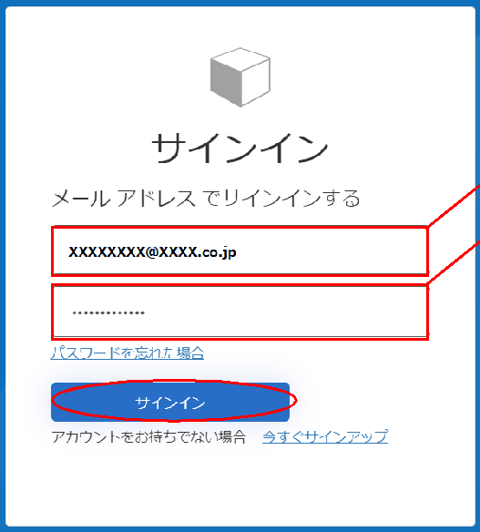

*(出典：Microsoft Corporation)*

#### 多要素認証画面の表示

多要素認証は、以下のいずれかの方式が選択できます。

1. **SMS による本人確認**

SMS にて通知される確認コードを多要素認証確認コード入力画面に入力することにより多要素認証を行う方式です。

2. **自動音声による本人確認**

登録した電話番号に発信される自動音声通話を受け取り、音声ガイダンスに従い、テンキーで「#」を入力することにより多要素認証を行う方式です。

SMS による本人確認を行う場合は「コードの送信」、自動音声による本人確認を行う場合は「電話する」をクリックします（「電話する」をクリックすると、入力した電話番号に自動音声通話を送信します。）。

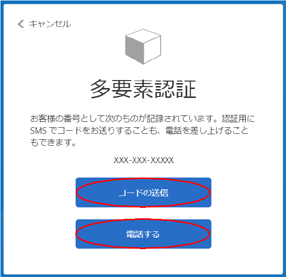

*(出典：Microsoft Corporation)*

> [!NOTE] **登録した電話番号のクリア**

> 一度登録した電話番号をクリアしたい場合は、API キー発行画面で「多要素認証クリア」をクリックしてください。登録した電話番号がクリアされ、次回サインイン時に改めて、電話番号が登録できるようになります。

> [!NOTE] **認証用に登録した電話が使用できない場合**

> 認証用に登録した電話番号が使用できず（紛失・故障等）、サインインできない場合、多要素認証クリアをヘルプデスク宛にメールにて依頼してください（メールアドレス：edinet-helpdesk@cec-ltd.co.jp）。ご依頼の際は、件名に「API の多要素認証クリア依頼」と記載し、本文は空欄で構いません。依頼メールは必ずアカウント作成に使用したメールアドレスを使って送信してください。

#### 確認コードの入力

SMS にて受け取った確認コードを入力します。確認コードを入力し、エンターキーを押すと API キー発行画面が編集モードで表示されます。API キー発行画面の操作は「2-3-2-1 API キーの発行」を参照してください。

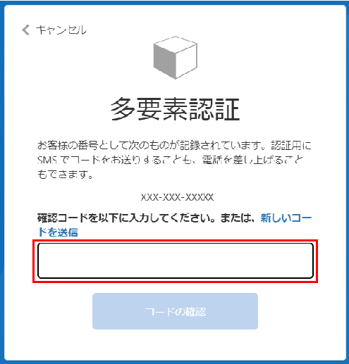

(出典：Microsoft Corporation)

#### API キー発行画面（編集モード）

以下の API キー発行画面が表示されます。登録した連絡先を変更したい場合は変更後の連絡先情報を入力し、「連絡先変更」をクリックしてください。

「API キー再発行」は再度 API キーを発行したい場合にご利用ください。

再発行した場合、再発行前の API キーは無効化されます。

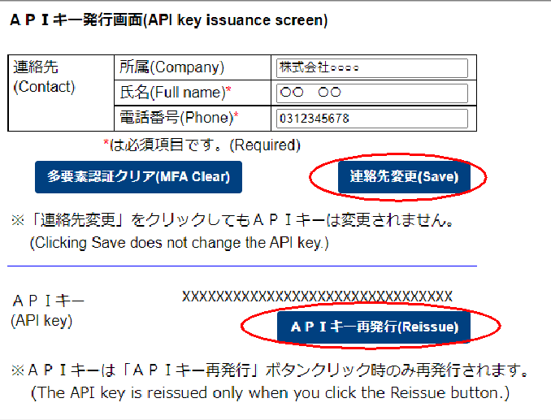

**＜連絡先変更＞**

「連絡先変更」のクリックで確認メッセージが表示されるため、「OK」をクリックします。

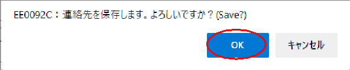

「OK」クリック時は、連絡先変更が行われた後に完了メッセージが表示されます。

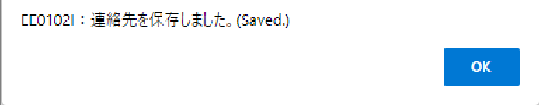

「キャンセル」クリック時は、連絡先変更は行われずに API キー発行画面に戻ります。

**＜API キー再発行＞**

「API キー再発行」のクリックで確認メッセージが表示されるため、「OK」をクリックします。

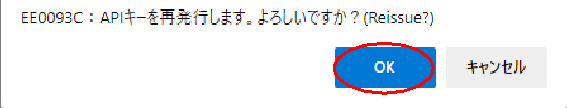

「OK」クリック時は、API キー再発行後に、API キー発行画面に再発行された API キーが表示されます。

「キャンセル」クリック時は、API キーの再発行は行われず、API キー発行画面に戻ります。

### 2-3-2-3 API キーの削除

API キーの削除を行う場合は、次の URL にアクセスし、サインイン画面を表示します。

https://api.edinet-fsa.go.jp/api/auth/index.aspx?mode=2

#### サインイン画面の表示

サインイン画面でメールアドレス入力欄及びパスワード入力欄に、アカウント作成時に入力したメールアドレスとパスワードを入力してください。入力後、「サインイン」ボタンをクリックすると多要素認証画面が表示されます。多要素認証画面からサインイン後、API キー発行画面が削除モードで表示されます。多要素認証からのサインインの操作は「2-3-2-2 連絡先の変更及び API キーの再発行」の「多要素認証画面の表示」及び「確認コードの入力」を参照してください。

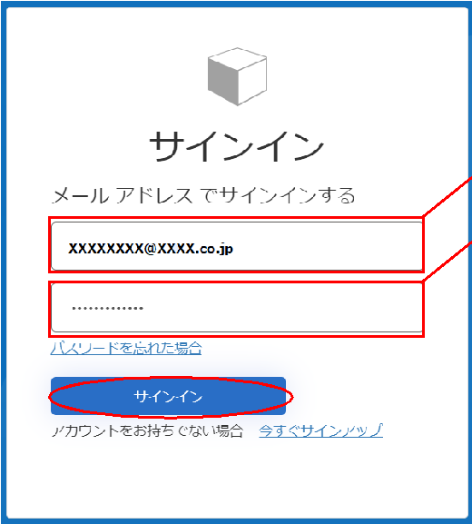

*(出典：Microsoft Corporation)*

#### API キー削除画面

API キーを削除する場合は、以下の画面で、「削除」をクリックしてください。「削除」をクリックすると、API キー、連絡先及びアカウントが削除されます。API キー削除操作を中止する場合は、「キャンセル」をクリックしてください。

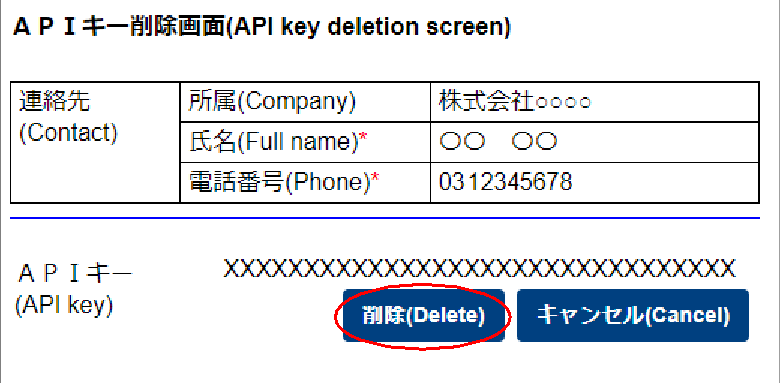

「削除」をクリックすると、確認メッセージが表示されるため、「OK」をクリックします。

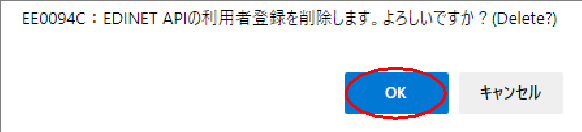

「OK」クリック時は、アカウントが削除され、API キー削除画面が閉じられます。「キャンセル」クリック時は、アカウントの削除は行われず、API キー削除画面に戻ります。

> [!CAUTION] **API キーの削除について**

> 2 年以上利用実績がない API キーについては、システムで自動的に削除を行います。利用を再開する場合にはお手数ですが、再度アカウントの作成から行ってください。

> [!CAUTION] **メールアドレスの変更について**

> メールアドレスは API キー発行に使用するアカウントのキー情報となっているため、メールアドレスを変更する場合本項記載の手順に従い、API キーを削除のうえ、改めて「2-3-1 アカウントの作成」から実施してください。

### 2-3-2-4 パスワードの再発行

パスワードを変更する場合又は忘れた場合は、パスワードを再発行します。EDINET の［閲覧サイト］に接続し、「ログイン」ボタンをクリックしてサインイン画面を表示します。


#### サインイン画面の表示

サインイン画面で「パスワードを忘れた場合」のリンクをクリックし、確認コード送信画面を表示します。

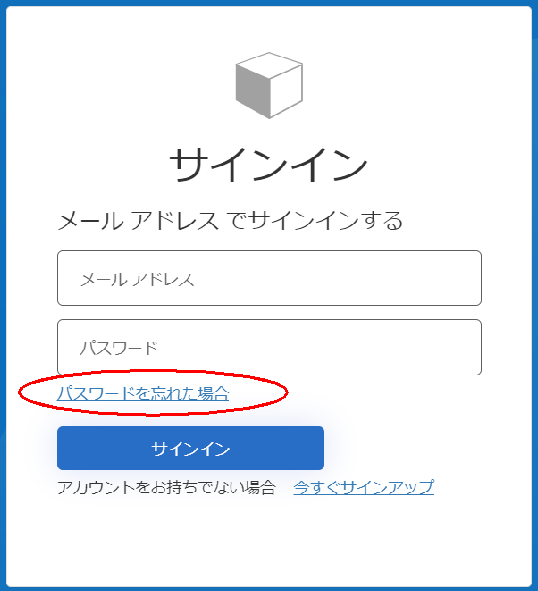

*(出典：Microsoft Corporation)*

#### 確認コードの送信

表示された確認コード送信画面で最上部の入力欄にメールアドレスを入力し、「確認コードを送信」をクリックすると、入力したメールアドレスに確認コードが記載されたメールが届きます。

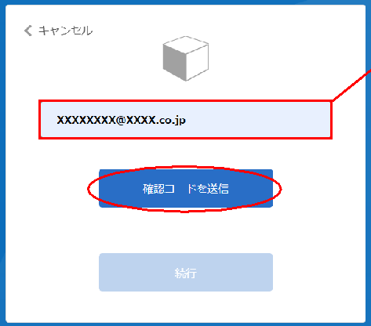

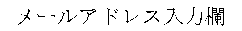 メールアドレス入力欄

*(出典：Microsoft Corporation)*

> [!CAUTION] **確認コードが届かない場合**

> 以下をご確認ください。

> - 入力したメールアドレスが正しいかどうかをご確認ください。

> - Microsoft アカウントからのメールが「迷惑メール」に入っていないか確認して、送信されたコードをお使いください。有効な確認コードは、「@microsoftonline.com」のメールアドレスから送られてきます。確認コードを受信トレイに受信するには、信頼された差出人として「@microsoftonline.com」を設定してください。

> - スマートフォンやケータイでメールを受信される場合は、通信環境の良いところで受信してください。

#### コードの確認

メールにて受信した確認コードを確認コード入力欄に入力し、「コードの確認」をクリックします。

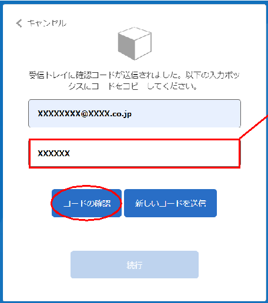

*(出典：Microsoft Corporation)*

※「新しいコードを送信」は確認コードを再送する場合に使用します。

#### コードの確認完了

入力したメールアドレス及びコードの確認が完了したため、「続行」ボタンをクリックし、パスワード入力画面を表示します。

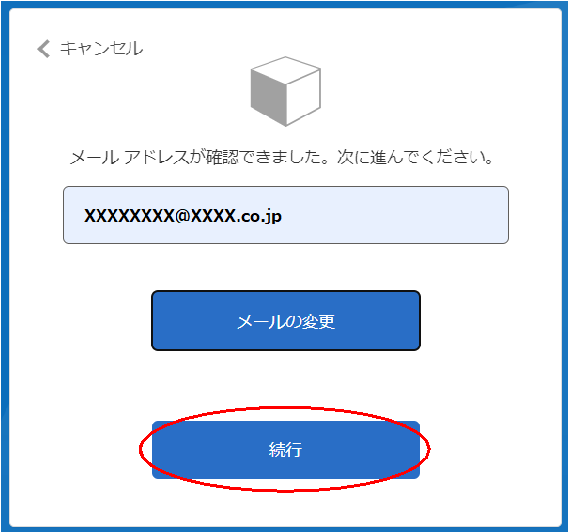

*(出典：Microsoft Corporation)*

※「メールの変更」はパスワード再発行時に指定するメールアドレスに誤りがあった場合に使用します。「メールの変更」ボタンをクリックすると、確認コードの送信画面が表示されます。詳細は、「2-3-2-4-2 パスワードの再発行」の「確認コードの送信」を参照してください。

#### パスワードの入力

パスワード入力欄及びパスワード確認欄に、同一のパスワードを入力してください。なお、パスワードについては、パスワードポリシー（2-3-1 「アカウントの作成について」「アカウントの作成」のNOTE参照）に従って設定してください。パスワード入力後、「続行」ボタンをクリックし、サインイン画面を表示します。

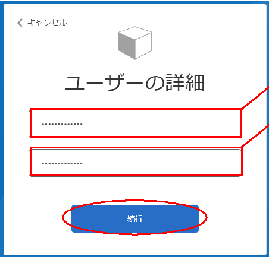

*(出典：Microsoft Corporation)*

#### サインイン画面の表示

サインイン画面でメールアドレスとパスワードを入力しサインインすることで、API キー発行画面を編集モードで表示します。詳細は、「2-3-2-2 連絡先の変更及び API キーの再発行」を参照してください。

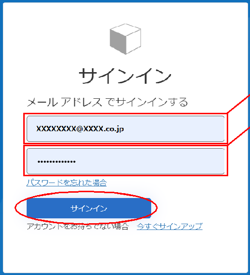

*(出典：Microsoft Corporation)*

### 2-3-2-5 多要素認証のクリア

多要素認証画面に登録した電話番号をクリアする場合は、API キー発行画面の「多要素認証クリア」クリックで行うことができます。

#### API キー発行画面の表示

EDINET の［閲覧サイト］に接続し、「ログイン」ボタンをクリックしてサインイン画面を表示します。


API キー発行画面表示までの手順は、「2-3-1-1 サインイン画面の表示」及び「2-3-2-2 連絡先の変更及び API キーの再発行」を参照してください。

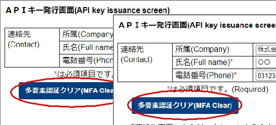

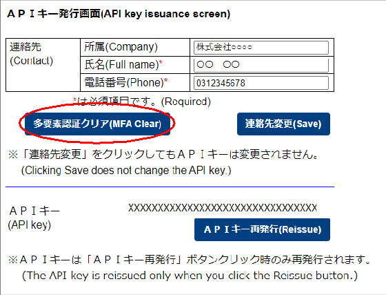

#### 多要素認証のクリア

「多要素認証クリア」のクリックで確認メッセージが表示されるため、「OK」をクリックします。操作を中断する場合は、「キャンセル」をクリックします。

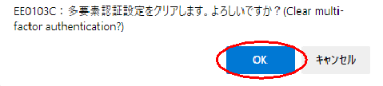

「OK」クリック時は、多要素認証クリア後に、完了メッセージが表示されます。

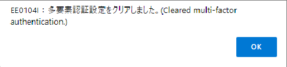

「キャンセル」クリック時は、多要素認証クリアは行われず、API キー発行画面に戻ります。

# 3 章 インターフェース仕様

## 3-1 書類一覧 API

書類一覧 API の仕様について説明します。

書類一覧 API では、「メタデータのみ」または「提出書類一覧及びメタデータ」を取得することが可能です。取得内容はリクエストパラメータで制御します。

本項ではリクエストについての説明と、取得できるデータ（メタデータ、提出書類一覧）毎のレスポンスについて説明します。

### 3-1-1 リクエストについて

書類一覧 API に送信するリクエストについて説明します。

#### リクエスト URL

REST 方式にて設計したリクエスト URL です。

`https://api.edinet-fsa.go.jp/api/{バージョン}/documents.json?date={ファイル日付}&type={取得情報}&Subscription-Key={APIキー}`

#### HTTP 通信方式

TLS1.2 以上のサポートにて暗号化通信を行います。

#### クロスドメイン通信について

EDINET API では、クロスドメインの通信を許可しません。ブラウザ上で動作するスクリプト（JavaScript 等）を利用した通信は行えない点に留意してください。

#### HTTP メソッド

GET メソッドを使用してください。

#### エンドポイント

REST 方式にて設計したエンドポイントを提供します。

`https://api.edinet-fsa.go.jp/api/{バージョン}/documents.json`

#### バージョン

エンドポイントに指定するバージョンは「v + 整数」で表記します。（例：v2）当仕様書はバージョン 2 を対象としておりますので v2 を指定ください。

#### リクエストパラメータ

書類一覧 API は次のパラメータが利用可能です。

| パラメータ名 | 項目名 | 必須 | 設定値 | 説明 |
| :--- | :--- | :--- | :--- | :--- |
| `date` | ファイル日付 (*1) | ○ | 日付 (YYYY-MM-DD 形式) | 出力対象とする提出書類一覧のファイル日付(*1)を指定します。 |
| `type` | 取得情報 | － | 1: メタデータのみ<br>2: 提出書類一覧及びメタデータ | 取得する情報の種類を指定します。指定が無い場合のデフォルト値は 1 です。 |
| `Subscription-Key` | API キー | ○ | 「2-3-2-1 API キーの発行」で画面に表示された API キー | EDINET API の認証に利用します。 |

＜凡例＞ ○：必須 －：任意

> CAUTION

> (*1) 「ファイル日付」は当日以前で、直近の財務局営業日の 24 時において 10 年を経過していない日付を指定することができます（土日祝日も指定可能）。指定のファイル日付の提出書類一覧には、当該日付に提出処理が行われた提出書類並びに当該日付に登録された書類情報修正及び開示不開示区分の変更が含まれます。
> 磁気ディスク提出又は紙面提出で提出日が書類提出操作より過去になる場合、当該書類提出の情報は、書類提出操作日をファイル日付とする提出書類一覧に記載されます。提出日をファイル日付とする提出書類一覧には記載されないので注意してください。

#### パラメータの指定方法

パラメータは次の方法で指定します。

- ① 「パラメータ名」と「設定値」を“=”で結合します。

- ② 複数のパラメータを設定する場合は、①で作成したパラメータ同士を“&”で結合します。

- ③ 「エンドポイント」と「②で作成したパラメータ文字列」を“?”で結合します。

#### 書類一覧 API のリクエスト URL（サンプル）

> [!NOTE]

書類一覧 API にて、ファイル日付が「2023 年 4 月 1 日」であるリクエストを送信する場合、リクエスト URL は次のような構成となります。
【取得情報="1"（メタデータのみ）（パラメータを省略）】

https://api.edinet-fsa.go.jp/api/v2/documents.json?date=2023-04-01&Subscription-Key=ZZZ…ZZZ

【取得情報="2"（提出書類一覧及びメタデータ）】

https://api.edinet-fsa.go.jp/api/v2/documents.json?date=2023-04-01&type=2&Subscription-Key=ZZZ…ZZZ

## 3-1-2 レスポンスについて

書類一覧 API から返却されるレスポンスについて説明します。


### 3-1-2-1 書類一覧 API（メタデータ）

取得情報に 1（メタデータのみ）を指定した書類一覧 API から返却されるレスポンスについて説明します。

### レスポンスヘッダ

レスポンスに設定されるヘッダ情報は次のとおりです。

|ヘッダ名|値|備考|
|---|---|---|
|Content-Type|application/json; charset=utf-8| |

### 出力データ内容

取得情報に 1（メタデータのみ）を指定した書類一覧 API から返却される出力データは、文字コードが UTF-8 である JSON 形式の文字列です。日付・時刻の項目は日本時間で出力されます。

出力データの各項目について説明します。

|№|項目名|項目 ID|型|文字種|桁数|説明|
|---|---|---|---|---|---|---|
|1|メタデータ|metadata|object|－|－|メタデータの識別子です。|
|2|タイトル|title|string|全半角|18|API の名称が出力されます。|
|3|パラメータ|parameter|object|－|－|リクエストパラメータの識別子です。|
|4|ファイル日付|date|string (YYYY-MM-DD 形式)|半角|10|指定したファイル日付が出力されます。|
|5|取得情報|type|string|半角|1|指定した取得情報が出力されます。|
|6|結果セット|resultset|object|－|－|結果セットの識別子です。|
|7|件数|count|number|半角|5 以下|指定したファイル日付における提出書類一覧の件数が出力されます。|
|8|書類一覧更新日時|processDateTime|string (YYYY-MM-DD hh:mm 形式)|半角|16|提出書類一覧の更新時間が出力されます。提出書類一覧の内容に変更がない場合でも書類一覧更新日時は更新されます。|
|9|ステータス|status|string|半角|3|「3-3 ステータスコード」に記載のステータスが出力されます（リクエスト成功時は「200」）。|
|10|メッセージ|message|string|半角|21 以下|「3-3 ステータスコード」に記載のメッセージが出力されます（リクエスト成功時は「OK」）。|

#### 書類一覧 API（メタデータ）の出力するデータの内容（サンプル）

取得情報に 1（メタデータのみ）を指定した書類一覧 API における出力データ内容は次のような構成となります。

##### A) 提出書類一覧が 1 件取得できる場合の出力データ内容

```json
{
  "metadata": {
    "title": "提出された書類を把握するための API",
    "parameter": {
      "date": "2023-04-03",
      "type": "1"
    },
    "resultset": {
      "count": 1
    },
    "processDateTime": "2023-04-03 13:01",
    "status": "200",
    "message": "OK"
  }
}
```
### 3-1-2-2 書類一覧 API（提出書類一覧及びメタデータ）

取得情報に 2（提出書類一覧及びメタデータ）を指定した書類一覧 API から返却されるレスポンスについて説明します。

### レスポンスヘッダ

レスポンスに設定されるヘッダ情報は次のとおりです。

|ヘッダ名|値|備考|
|---|---|---|
|Content-Type|application/json; charset=utf-8| |

### 出力データ内容

取得情報に 2（提出書類一覧及びメタデータ）を指定した書類一覧 API から返却される出力データは、文字コードが UTF-8 である JSON 形式の文字列です。日付・時刻の項目は日本時間で出力されます。

提出書類一覧には、提出された書類に加えて「3-1-6 財務局職員による書類情報修正」、「3-1-7 財務局職員による書類の不開示」を行った旨の情報が出力されます。

出力データの各項目について説明します。

|№|項目名|項目 ID|型|文字種|桁数|説明|
|---|---|---|---|---|---|---|
|1|メタデータ|metadata|object|－|－|メタデータの識別子です。|
|2|タイトル|title|string|全半角|18|API の名称が出力されます。|
|3|パラメータ|parameter|object|－|－|リクエストパラメータの識別子です。|
|4|ファイル日付|date|string (YYYY-MM-DD 形式)|半角|10|指定したファイル日付が出力されます。|
|5|取得情報|type|string|半角|1|指定した取得情報が出力されます。|
|6|結果セット|resultset|object|－|－|結果セットの識別子です。|
|7|件数|count|number|半角|5 以下|指定したファイル日付における提出書類一覧の件数が出力されます。|
|8|書類一覧更新日時|processDateTime|string (YYYY-MM-DD hh:mm 形式)|半角|16|提出書類一覧の更新時間が出力されます。提出書類一覧の内容に変更がない場合でも書類一覧更新日時は更新されます。|
|9|ステータス|status|string|半角|3|「3-3 ステータスコード」に記載のステータスが出力されます（リクエスト成功時は「200」）。|
|10|メッセージ|message|string|半角|21 以下|「3-3 ステータスコード」に記載のメッセージが出力されます（リクエスト成功時は「OK」）。|
|11|提出書類一覧|results|array|－|－|提出書類一覧の識別子です。|
| |提出書類（繰り返し）| - |object|－|－|－|
|12|連番|seqNumber|number|半角|5 以下|ファイル日付ごとの連番です。詳細は「注意 提出書類一覧の連番について」を参照してください。|
|13|書類管理番号 (*1)|docID|string|半角|8|書類管理番号が出力されます。|
|14|提出者 EDINET コード(*1) (*2)|edinetCode|string|半角|6|提出者の EDINET コードが出力されます。|
|15|提出者証券コード(*2)|secCode|string|半角|5|提出者の証券コードが出力されます。|
|16|提出者法人番号(*2)|JCN|string|半角|13|提出者の法人番号が出力されます。|
|17|提出者名(*2)|filerName|string|全角|128 以下|提出者の名前が出力されます。|
|18|ファンドコード (*1)|fundCode|string|半角|6|ファンドコードが出力されます。|
|19|府令コード(*1)|ordinanceCode|string|半角|3|府令コードが出力されます。|
|20|様式コード(*1)|formCode|string|半角|6|様式コードが出力されます。|
|21|書類種別コード (*1)|docTypeCode|string|半角|3|書類種別コードが出力されます。|
|22|期間（自）(*3)|periodStart|string (YYYY-MM-DD 形式)|半角|10|期間（自）が出力されます。|
|23|期間（至）(*3)|periodEnd|string (YYYY-MM-DD 形式)|半角|10|期間（至）が出力されます。|
|24|提出日時|submitDateTime|string (YYYY-MM-DD hh:mm 形式)|半角|16|提出日時が出力されます。|
|25|提出書類概要|docDescription|string|全半角|147 以下|EDINET の閲覧サイトの書類検索結果画面において、「提出書類」欄に表示される文字列が出力されます。|
|26|発行会社 EDINET コード (*1) (*2)|issuerEdinetCode|string|半角|6|大量保有について発行会社の EDINET コードが出力されます。|
|27|対象 EDINET コード(*1) (*2)|subjectEdinetCode|string|半角|6|公開買付けについて対象となる EDINET コードが出力されます。|
|28|子会社 EDINET コード(*1) (*2)|subsidiaryEdinetCode|string|半角|69 以下|子会社の EDINET コードが出力されます。複数存在する場合（最大 10 個）、","（カンマ）で結合した文字列が出力されます。|
|29|臨報提出事由 (*4)|currentReportReason|string|全半角|1000 以下|臨時報告書の提出事由が出力されます。複数存在する場合、","（カンマ）で結合した文字列が出力されます。|
|30|親書類管理番号(*1)|parentDocID|string|半角|8|親書類管理番号が出力されます。|
|31|操作日時|opeDateTime|string (YYYY-MM-DD hh:mm 形式)|半角|16|「3-1-6 財務局職員による書類情報修正」、「3-1-7 財務局職員による書類の不開示」、磁気ディスク提出及び紙面提出を行った日時が出力されます。|
|32|取下区分|withdrawalStatus|string|半角|1|取下書は"1"、取り下げられた書類は"2"、それ以外は"0"が出力されます。詳細は「3-1-5 書類の取下げ」を参照してください。|
|33|書類情報修正区分|docInfoEditStatus|string|半角|1|財務局職員が書類を修正した情報は"1"、修正された書類は"2"、それ以外は"0"が出力されます。詳細は「3-1-6 財務局職員による書類情報修正」を参照してください。|
|34|開示不開示区分|disclosureStatus|string|半角|1|財務局職員によって書類の不開示を開始した情報は"1"、不開示とされている書類は"2"、財務局職員によって書類の不開示を解除した情報は"3"、それ以外は"0"が出力されます。詳細は「3-1-7 財務局職員による書類の不開示」を参照してください。|
|35|XBRL 有無フラグ|xbrlFlag|string|半角|1|書類に XBRL がある場合は"1"、それ以外は"0"が出力されます。|
|36|PDF 有無フラグ(*5)|pdfFlag|string|半角|1|書類に PDF がある場合は"1"、それ以外は"0"が出力されます。|
|37|代替書面・添付文書有無フラグ|attachDocFlag|string|半角|1|書類に代替書面・添付文書がある場合は"1"、それ以外は"0"が出力されます。|
|38|英文ファイル有無フラグ|englishDocFlag|string|半角|1|書類に英文ファイルがある場合は"1"、それ以外は"0"が出力されます。|
|39|CSV 有無フラグ|csvFlag|string|半角|1|書類に CSV ファイルがある場合は"1"、それ以外は"0"が出力されます。|
|40|縦覧区分|legalStatus|string|半角|1|"1"：縦覧中<br>"2"：延長期間中（法定縦覧期間満了書類だが引き続き閲覧可能。）<br>"0"：閲覧期間満了（縦覧期間満了かつ延長期間なし、延長期間満了又は取下げにより閲覧できないもの。なお、不開示は含まない。）詳細は「1-2-2 EDINET API で取得対象となるデータの範囲」を参照してください。|
---
- *1 設定値については「4-1 参考資料」を参照してください。
- *2 これらの情報（EDINET コード及びこれに紐づく属性情報）は、変更されることがありますが、その場合でも提出書類一覧上は変更されません。これらの情報の変更については「3-1-8 提出者情報の変更について」を参照してください。
- *3 期間は、有価証券報告書及び半期報告書では事業年度、四半期報告書では四半期会計期間がそれぞれ出力されます。その他の書類種別では期間は出力されません。
- *4 臨報提出事由は、「第 19 条第 2 項第 1 号」、「第 29 条第 2 項第 1 号」のように記載され、「第 19 条」は企業内容等の開示に関する内閣府令第 19 条を、「第 29 条」は特定有価証券の内容等の開示に関する内閣府令第 29 条をそれぞれ意味します。
- *5 「PDF」は、EDINET の検索結果一覧画面に表示される「PDF 表示」の文字列リンクをクリックすることにより取得可能な PDF のことであり、その他の PDF は含みません。

#### 提出書類一覧の連番について

> [!CAUTION]

提出書類一覧の連番は、同じファイル日付の一覧内において、一度付与されてから変わることがない番号です。

当日は書類の提出が増えるにつれ、提出書類一覧に出力される件数が増加します。提出書類一覧は基本的に「書類の提出日時（操作日時が設定されている場合は操作日時を使用）」の順に追加されます。

当日の提出書類一覧を同日に複数回取得する場合、前回取得時に取得した最後の連番より大きい連番を対象とすることで、漏れなく書類を取得することができます。

##### A) 当日（2023-04-03）の提出書類一覧を同日に 2 回取得したケース

【1 回目】12:00 時点で取得した提出書類一覧
件数：13
- 書類 A 連番：1 提出日時：2023-04-03 09:00
- 書類 B 連番：2 提出日時：2023-04-03 09:01
～ 中略 ～
- 書類 M 連番：13 提出日時：2023-04-03 11:59

【2 回目】17:00 時点で取得した提出書類一覧
件数：26
- 書類 A 連番：1 提出日時：2023-04-03 09:00
- 書類 B 連番：2 提出日時：2023-04-03 09:01
～ 中略 ～
- 書類 M 連番：13 提出日時：2023-04-03 11:59
- 書類 N 連番：14 提出日時：2023-04-03 12:01
～ 中略 ～
- 書類 Z 連番：26 提出日時：2023-04-03 16:59

この例では、連番「14」（書類 N）以降が新しく追加された情報となります。（12:00～17:00 の間に提出された書類や「3-1-6 財務局職員による書類情報修正」等の情報）

#### 書類一覧 API（提出書類一覧及びメタデータ）の出力するデータの内容（サンプル）

> [!NOTE]

取得情報に 2（提出書類一覧及びメタデータ）を指定した書類一覧 API における出力データ内容は次のような構成となります。

##### A) 提出書類一覧が 2 件取得できる場合の出力データ内容

```json
{
  "metadata": {
    "title": "提出された書類を把握するための API",
    "parameter": {
      "date": "2023-04-03",
      "type": "2"
    },
    "resultset": {
      "count": 2
    },
    "processDateTime": "2023-04-03 13:01",
    "status": "200",
    "message": "OK"
  },
  "results": [
    {
      "seqNumber": 1,
      "docID": "S1000001",
      "edinetCode": "E10001",
      "secCode": "10000",
      "JCN": "6000012010023",
      "filerName": "エディネット株式会社",
      "fundCode": "G00001",
      "ordinanceCode": "030",
      "formCode": "04A000",
      "docTypeCode": "030",
      "periodStart": null,
      "periodEnd": null,
      "submitDateTime": "2023-04-03 12:34",
      "docDescription": "有価証券届出書（内国投資信託受益証券）",
      "issuerEdinetCode": null,
      "subjectEdinetCode": null,
      "subsidiaryEdinetCode": null,
      "currentReportReason": null,
      "parentDocID": null,
      "opeDateTime": null,
      "withdrawalStatus": "0",
      "docInfoEditStatus": "0",
      "disclosureStatus": "0",
      "xbrlFlag": "1",
      "pdfFlag": "1",
      "attachDocFlag": "1",
      "englishDocFlag": "0",
      "csvFlag": "1",
      "legalStatus": "1"
    },
    {
      /* 書類情報の繰り返し */
    }
  ]
}
```

##### B) 提出書類一覧が 1 件取得できる場合の出力データ内容

```json
{
  "metadata": {
    "title": "提出された書類を把握するための API",
    "parameter": {
      "date": "2023-04-03",
      "type": "2"
    },
    "resultset": {
      "count": 1
    },
    "processDateTime": "2023-04-03 13:01",
    "status": "200",
    "message": "OK"
  },
  "results": [
    {
      "seqNumber": 1,
      "docID": "S1000001",
      "edinetCode": "E10001",
      "secCode": "10000",
      "JCN": "6000012010023",
      "filerName": "エディネット株式会社",
      "fundCode": "G00001",
      "ordinanceCode": "030",
      "formCode": "04A000",
      "docTypeCode": "030",
      "periodStart": null,
      "periodEnd": null,
      "submitDateTime": "2023-04-03 12:34",
      "docDescription": "有価証券届出書（内国投資信託受益証券）",
      "issuerEdinetCode": null,
      "subjectEdinetCode": null,
      "subsidiaryEdinetCode": null,
      "currentReportReason": null,
      "parentDocID": null,
      "opeDateTime": null,
      "withdrawalStatus": "0",
      "docInfoEditStatus": "0",
      "disclosureStatus": "0",
      "xbrlFlag": "1",
      "pdfFlag": "1",
      "attachDocFlag": "1",
      "englishDocFlag": "0",
      "csvFlag": "1",
      "legalStatus": "1"
    }
  ]
}
```

##### C) 提出書類一覧が 1 件も取得できない場合の出力データ内容

```json
{
  "metadata": {
    "title": "提出された書類を把握するための API",
    "parameter": {
      "date": "2023-04-03",
      "type": "2"
    },
    "resultset": {
      "count": 0
    },
    "processDateTime": "2023-04-03 13:01",
    "status": "200",
    "message": "OK"
  },
  "results": []
}
```
## 3-1-3 メタデータ及び提出書類一覧の更新タイミング

書類一覧 API にて取得できるメタデータ及び提出書類一覧（以下「3-1-3 メタデータ及び提出書類一覧の更新タイミング」において「データ」という。）は、一定のタイミングで情報が更新されます。

### 3-1-3-1 更新対象となるデータ

書類一覧 API の「ファイル日付」パラメータに当日を指定して取得できるデータ（以下「当日分のデータ」という。）及び過去日を指定して取得できるデータ（以下「過去分のデータ」という。）は、それぞれ次のような更新が発生します。

**当日分のデータ（全て、発生時に情報が追加される）：**
- 書類提出（取下書を含む）
- 「3-1-6 財務局職員による書類情報修正」の発生
- 「3-1-7 財務局職員による書類の不開示」による不開示の開始及び解除の発生

**過去分のデータ（全て、既存の情報に対する更新となる）：**
- 縦覧期間満了（延長期間あり）の書類に対する縦覧区分の更新及び閲覧期間満了となった書類に関する情報削除（詳細は、「1-2-2 EDINET API で取得対象となるデータの範囲」を参照してください。）
- 取下書の提出により、取下げられた書類に関する情報削除と取下区分の設定（詳細は、「3-1-5 書類の取下げ」を参照してください。）
- 「3-1-6 財務局職員による書類情報修正」の発生により、情報が修正された書類に対する書類情報修正区分の設定
- 「3-1-7 財務局職員による書類の不開示」により不開示が開始されたあるいは解除された書類に対する開示不開示区分の設定

### 3-1-3-2 当日分のデータ更新タイミング

当日分のデータは、日本時間 8 時 30 分過ぎから、原則 1 分毎に更新されます。提出書類一覧の内容に変更がない場合でも当日分のファイルが差し替えられます。

### 3-1-3-3 過去分のデータ更新タイミング

過去分のデータは、1 暦日毎に更新されます（同更新を以下「日次更新処理」という）。更新開始時刻は日本時間 24 時過ぎです。

日次更新処理では、提出書類一覧の内容に変更がないファイル日付のものも含め、全てのファイル日付のファイルが差し替えられます。また、10 年を経過したファイル日付のファイルは削除されます。

日次更新処理の最後に当日分ファイルを作成します。したがって、当日分のファイルが書類一覧 API で取得可能になっていれば、日次更新処理が完了し、前日までのデータが確定していると判定できます。

> [!CAUTION]
> **提出書類一覧に記載されている書類が取得できない場合**
> 提出書類一覧は一定タイミングで更新されるため、EDINET 上では開示されていない書類が、提出書類一覧に開示中の提出書類として残っている状態が起こりえます。その場合、書類取得 API による書類の取得はできませんので注意してください。

## 3-1-4 閲覧期間の満了

縦覧期間が満了し延長期間がある場合、提出書類一覧において、当該書類に関する情報は、縦覧区分＝"2"（延長期間中）に更新されます。閲覧期間が満了した場合（縦覧期間が満了し延長期間がない場合又は延長期間が満了した場合）、提出書類一覧において、当該書類に関する情報は、縦覧区分＝"0"（閲覧期間満了）となり、連番及び書類管理番号以外が null（区分及びフラグは"0"）に更新されます。閲覧期間が満了した書類は、書類取得 API で取得することはできません。

詳細は「1-2-2 EDINET API で取得対象となるデータの範囲」を参照してください。

閲覧期間が満了した書類の出力データ内容（サンプル）は次のとおりです。閲覧期間満了により更新される箇所を下線としています。（対象となるデータのみ部分的に記載します。）

```json
{
  "seqNumber": 1,
  "docID": "S1000001",
  "edinetCode": null,
  "secCode": null,
  "JCN": null,
  "filerName": null,
  "fundCode": null,
  "ordinanceCode": null,
  "formCode": null,
  "docTypeCode": null,
  "periodStart": null,
  "periodEnd": null,
  "submitDateTime": null,
  "docDescription": null,
  "issuerEdinetCode": null,
  "subjectEdinetCode": null,
  "subsidiaryEdinetCode": null,
  "currentReportReason": null,
  "parentDocID": null,
  "opeDateTime": null,
  "withdrawalStatus": "0",
  "docInfoEditStatus": "0",
  "disclosureStatus": "0",
  "xbrlFlag": "0",
  "pdfFlag": "0",
  "attachDocFlag": "0",
  "englishDocFlag": "0",
  "csvFlag": "0",
  "legalStatus": "0"
}
```
## 3-1-5 書類の取下げ

開示した書類は法令の規定により、取下げられることがあります。このように、一度開示された書類が途中から非開示になるケースがあります。EDINET API では、書類が取下げられたことを把握できるようにするため、書類一覧 API（提出書類一覧及びメタデータ）には取下書のデータが出力されます。取下書は非開示書類のため、必要となる情報のみが出力されます。また、取下げられた書類は、取下書提出日の日本時間 24 時過ぎに日次更新処理により、連番、書類管理番号、親書類管理番号及び取下区分以外が null（区分及びフラグは"0"）に更新されます。

取下書及び取下げられた書類は、書類取得 API で取得することはできません。

2023-04-03 に提出された書類（2023-04-17 に訂正書提出あり）に対し、2023-05-01 に取下書を提出された場合の出力データ内容（サンプル）は次のとおりです。取下げられた書類は、取下げにより更新される箇所を下線としています。取下書は、取下書に特徴的な個所を下線としています。

（対象となるデータのみ部分的に記載します。）

##### 直接取下げられた書類の情報（2023-05-02 以降、リクエストパラメータとしてファイル日付に 2023-04-03 を指定して得られる情報。）

```json
{
  "seqNumber": 1,
  "docID": "S1000001",
  "edinetCode": null,
  "secCode": null,
  "JCN": null,
  "filerName": null,
  "fundCode": null,
  "ordinanceCode": null,
  "formCode": null,
  "docTypeCode": null,
  "periodStart": null,
  "periodEnd": null,
  "submitDateTime": null,
  "docDescription": null,
  "issuerEdinetCode": null,
  "subjectEdinetCode": null,
  "subsidiaryEdinetCode": null,
  "currentReportReason": null,
  "parentDocID": null,
  "opeDateTime": null,
  "withdrawalStatus": "2",
  "docInfoEditStatus": "0",
  "disclosureStatus": "0",
  "xbrlFlag": "0",
  "pdfFlag": "0",
  "attachDocFlag": "0",
  "englishDocFlag": "0",
  "csvFlag": "0",
  "legalStatus": "0"
}
```

##### 親書類が取下げられたことに伴って取下げられた書類の情報（2023-05-02 以降、リクエストパラメータとしてファイル日付に 2023-04-17 を指定して得られる情報。）

```json
{
  "seqNumber": 1,
  "docID": "S1000002",
  "edinetCode": null,
  "secCode": null,
  "JCN": null,
  "filerName": null,
  "fundCode": null,
  "ordinanceCode": null,
  "formCode": null,
  "docTypeCode": null,
  "periodStart": null,
  "periodEnd": null,
  "submitDateTime": null,
  "docDescription": null,
  "issuerEdinetCode": null,
  "subjectEdinetCode": null,
  "subsidiaryEdinetCode": null,
  "currentReportReason": null,
  "parentDocID": "S1000001",
  "opeDateTime": null,
  "withdrawalStatus": "2",
  "docInfoEditStatus": "0",
  "disclosureStatus": "0",
  "xbrlFlag": "0",
  "pdfFlag": "0",
  "attachDocFlag": "0",
  "englishDocFlag": "0",
  "csvFlag": "0",
  "legalStatus": "0"
}
```

##### 取下書の情報（取下書提出直後から、リクエストパラメータとしてファイル日付に 2023-05-01 を指定して得られる情報）

```json
{
  "seqNumber": 99,
  "docID": "S1000003",
  "edinetCode": null,
  "secCode": null,
  "JCN": null,
  "filerName": null,
  "fundCode": null,
  "ordinanceCode": "030",
  "formCode": null,
  "docTypeCode": null,
  "periodStart": null,
  "periodEnd": null,
  "submitDateTime": "2023-05-01 09:30",
  "docDescription": null,
  "issuerEdinetCode": null,
  "subjectEdinetCode": null,
  "subsidiaryEdinetCode": null,
  "currentReportReason": null,
  "parentDocID": "S1000001",
  "opeDateTime": null,
  "withdrawalStatus": "1",
  "docInfoEditStatus": "0",
  "disclosureStatus": "0",
  "xbrlFlag": "0",
  "pdfFlag": "0",
  "attachDocFlag": "0",
  "englishDocFlag": "0",
  "csvFlag": "0",
  "legalStatus": "0"
}
```

### 書類の取下げ例

> [!NOTE]

書類の取下げ例について、次に示します。

#### A) 親書類が取下げられたケース

■ 取下前後の各書類の親子関係

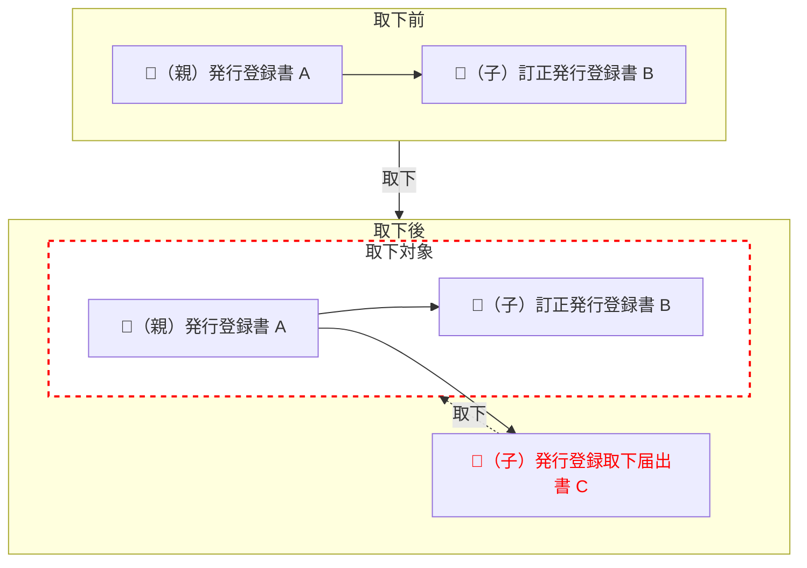
```mermaid
flowchart TB
    subgraph BEFORE["取下前"]
        A1["📁（親）発行登録書 A"]
        B1["📁（子）訂正発行登録書 B"]
        A1 --> B1
    end

    BEFORE -->|取下| AFTER

    subgraph AFTER["取下後"]
        subgraph TARGET["取下対象"]
            A2["📁（親）発行登録書 A"]
            B2["📁（子）訂正発行登録書 B"]
            A2 --> B2
        end

        C2["📁（子）発行登録取下届出書 C"]
        A2 --> C2
    end

    C2 -.->|取下| TARGET

    style TARGET stroke:#ff0000,stroke-width:2px,stroke-dasharray:5 5,fill:#fff
    style C2 color:#ff0000
```

提出書類一覧の出力データ内容（2023-04-03時点。取下書提出後）

|書類|書類管理番号|親書類管理番号|取下区分|
|---|---|---|---|
|発行登録書 A|S1000001|-|0|
|訂正発行登録書 B|S1000002|S1000001|0|
|発行登録取下届出書 C|S1000003|S1000001|1|

提出書類一覧の出力データ内容（2023-04-04時点。取下書提出後）

|書類|書類管理番号|親書類管理番号|取下区分|
|---|---|---|---|
|発行登録書 A|S1000001|-|2|
|訂正発行登録書 B|S1000002|S1000001|2|
|発行登録取下届出書 C|S1000003|S1000001|1|

※ この例では、書類全てが 2023-04-03 に提出された前提で、同じ提出書類一覧に表記している。

##### B) 子書類が取下げられたケース

■ 取下前後の各書類の親子関係

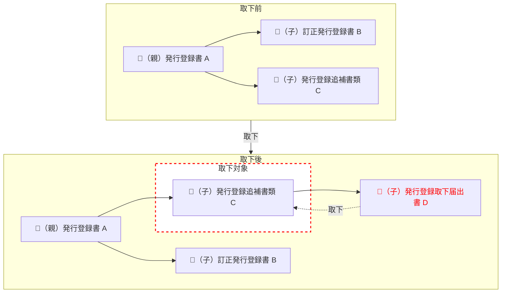
```mermaid
flowchart TB
    subgraph BEFORE["取下前"]
        A1["📁（親）発行登録書 A"]
        B1["📁（子）訂正発行登録書 B"]
        C1["📁（子）発行登録追補書類 C"]

        A1 --> B1
        A1 --> C1
    end

    BEFORE -->|取下| AFTER

    subgraph AFTER["取下後"]
        A2["📁（親）発行登録書 A"]
        B2["📁（子）訂正発行登録書 B"]

        subgraph TARGET["取下対象"]
            C2["📁（子）発行登録追補書類 C"]
        end

        D2["📁（子）発行登録取下届出書 D"]

        A2 --> B2
        A2 --> C2
        C2 --> D2
    end

    D2 -.->|取下| C2

    style TARGET stroke:#ff0000,stroke-width:2px,stroke-dasharray:5 5,fill:#fff
    style D2 color:#ff0000
```

■ 提出書類一覧の出力データ内容（2023-04-04 時点）
2023-04-03 の提出書類一覧
|書類|書類管理番号|親書類管理番号|取下区分|
|---|---|---|---|
|発行登録書 A|S2000001|-|0|
|訂正発行登録書 B|S2000002|S2000001|0|
|発行登録追補書類 C|S2000003|S2000001|0|

2023-04-04 の提出書類一覧
|書類|書類管理番号|親書類管理番号|取下区分|
|---|---|---|---|
|発行登録取下届出書 D|S2000004|S2000003|1|

■ 提出書類一覧の出力データ内容（2023-04-05 以降）
2023-04-03 の提出書類一覧
|書類|書類管理番号|親書類管理番号|取下区分|
|---|---|---|---|
|発行登録書 A|S2000001|-|0|
|訂正発行登録書 B|S2000002|S2000001|0|
|発行登録追補書類 C|S2000003|S2000001|2|

2023-04-04 の提出書類一覧
|書類|書類管理番号|親書類管理番号|取下区分|
|---|---|---|---|
|発行登録取下届出書 D|S2000004|S2000003|1|

※ この例では、書類 A,B,C が 2023-04-03 に、書類 D が 2023-04-04 に提出された前提で、別々の提出書類一覧に表記している。
## 3-1-6 財務局職員による書類情報修正

提出書類に付随して提出者が EDINET に登録した情報は、提出後に入力誤り等の修正が必要となる場合があります。EDINET API では、提供する情報のうち、書類に紐づく情報が修正されたことを把握できるようにするため、書類一覧 API（提出書類一覧及びメタデータ）に書類情報修正の情報を出力します。

提出された書類自体は修正されないため、書類取得 API で取得できる書類は、書類情報修正の前後で同一です。

※ 修正される場合がある項目は次のとおりです。
「ファンドコード」「府令コード」「様式コード」「書類種別コード」「期間（自）」「期間（至）」「提出日時」「提出書類概要」「発行会社 EDINET コード」「対象 EDINET コード」「子会社 EDINET コード」「親書類管理番号」

書類情報修正の出力データ内容（2023-06-12 に提出された書類についての情報修正（様式コード及び期間（自）の修正）が 2023-06-13 に発生した場合のサンプル）は次のとおりです。

（対象となるデータのみ部分的に記載します。）

##### 修正された書類の情報（リクエストパラメータとしてファイル日付に 2023-06-12 を指定して得られる情報。2023-06-14 から、下線部の区分が更新された状態となる。）

```json
{
  "seqNumber": 1,
  "docID": "S1000001",
  "edinetCode": "E10001",
  "secCode": "10000",
  "JCN": "6000012010023",
  "filerName": "エディネット株式会社",
  "fundCode": "G00001",
  "ordinanceCode": "030",
  "formCode": "07A000",
  "docTypeCode": "120",
  "periodStart": "2022-04-01",
  "periodEnd": "2023-03-31",
  "submitDateTime": "2023-06-12 12:34",
  "docDescription": "有価証券報告書（内国投資信託受益証券）－第 1期(令和 4 年 4 月 1 日－令和 5 年 3 月 31 日)",
  "issuerEdinetCode": null,
  "subjectEdinetCode": null,
  "subsidiaryEdinetCode": null,
  "currentReportReason": null,
  "parentDocID": null,
  "opeDateTime": null,
  "withdrawalStatus": "0",
  "docInfoEditStatus": "2",
  "disclosureStatus": "0",
  "xbrlFlag": "1",
  "pdfFlag": "1",
  "attachDocFlag": "1",
  "englishDocFlag": "0",
  "csvFlag": "1",
  "legalStatus": "1"
}
```

##### 修正されたことを示す情報（リクエストパラメータとしてファイル日付に 2023-06-13 を指定して得られる情報。下線部は修正された情報に該当する箇所。修正された事実が登録された時点で明らかとなり、その後変わることは無い。）

```json
{
  "seqNumber": 99,
  "docID": "S1000001",
  "edinetCode": "E10001",
  "secCode": "10000",
  "JCN": "6000012010023",
  "filerName": "エディネット株式会社",
  "fundCode": "G00001",
  "ordinanceCode": "030",
  "formCode": "07B000",
  "docTypeCode": "120",
  "periodStart": "2022-05-02",
  "periodEnd": "2023-03-31",
  "submitDateTime": "2023-06-12 12:34",
  "docDescription": "有価証券報告書（内国投資証券）－第 1 期(令和4 年 5 月 2 日－令和 5 年 3 月 31 日)",
  "issuerEdinetCode": null,
  "subjectEdinetCode": null,
  "subsidiaryEdinetCode": null,
  "currentReportReason": null,
  "parentDocID": null,
  "opeDateTime": "2023-06-13 09:30",
  "withdrawalStatus": "0",
  "docInfoEditStatus": "1",
  "disclosureStatus": "0",
  "xbrlFlag": "1",
  "pdfFlag": "1",
  "attachDocFlag": "1",
  "englishDocFlag": "0",
  "csvFlag": "1",
  "legalStatus": "1"
}
```
## 3-1-7 財務局職員による書類の不開示

提出書類は、開示後に、書類の全てまたは一部が不開示となることがあります。また、不開示が解除される場合もあります。EDINET API では、不開示の開始及び解除を把握できるようにするため、書類一覧 API（提出書類一覧及びメタデータ）には不開示の開始及び解除を示す情報が出力されます。

不開示となった書類は、書類取得 API で取得すると不開示となった旨を示す PDF ファイルが取得されます。全てが不開示となった書類及び一部が不開示かつ XBRL のダウンロードを不可とされた書類は、XBRL ファイル及び CSV ファイルは取得できません。

提出書類一覧の不開示の出力データ内容（2023-04-03 に提出した書類に、2023-05-01 に不開示が開始され、2023-06-01 に不開示が解除となった場合のサンプル）は次のとおりです。

（対象となるデータのみ部分的に記載します。）

##### 不開示を開始した書類の情報（リクエストパラメータとしてファイル日付に 2023-04-03 を指定して得られる情報。2023-05-02 から、下線部の区分が更新された状態となる。）

```json
{
  "seqNumber": 1,
  "docID": "S1000001",
  "edinetCode": "E10001",
  "secCode": "10000",
  "JCN": "6000012010023",
  "filerName": "エディネット株式会社",
  "fundCode": "G00001",
  "ordinanceCode": "030",
  "formCode": "04A000",
  "docTypeCode": "030",
  "periodStart": null,
  "periodEnd": null,
  "submitDateTime": "2023-04-03 12:34",
  "docDescription": "有価証券届出書（内国投資信託受益証券）",
  "issuerEdinetCode": null,
  "subjectEdinetCode": null,
  "subsidiaryEdinetCode": null,
  "currentReportReason": null,
  "parentDocID": null,
  "opeDateTime": null,
  "withdrawalStatus": "0",
  "docInfoEditStatus": "0",
  "disclosureStatus": "2",
  "xbrlFlag": "1",
  "pdfFlag": "1",
  "attachDocFlag": "1",
  "englishDocFlag": "0",
  "csvFlag": "1",
  "legalStatus": "1"
}
```

##### 不開示の開始を示す情報（リクエストパラメータとしてファイル日付に 2023-05-01 を指定して得られる情報。不開示となった事実が登録された時点の書類及び提出者の情報が登録され、その後変わることは無い。）

```json
{
  "seqNumber": 99,
  "docID": "S1000001",
  "edinetCode": "E10001",
  "secCode": "10000",
  "JCN": "6000012010023",
  "filerName": "エディネット株式会社",
  "fundCode": "G00001",
  "ordinanceCode": "030",
  "formCode": "04A000",
  "docTypeCode": "030",
  "periodStart": null,
  "periodEnd": null,
  "submitDateTime": "2023-04-03 12:34",
  "docDescription": "有価証券届出書（内国投資信託受益証券）",
  "issuerEdinetCode": null,
  "subjectEdinetCode": null,
  "subsidiaryEdinetCode": null,
  "currentReportReason": null,
  "parentDocID": null,
  "opeDateTime": "2023-05-01 19:30",
  "withdrawalStatus": "0",
  "docInfoEditStatus": "0",
  "disclosureStatus": "1",
  "xbrlFlag": "1",
  "pdfFlag": "1",
  "attachDocFlag": "1",
  "englishDocFlag": "0",
  "csvFlag": "1",
  "legalStatus": "1"
}
```

##### 不開示を解除した書類の情報（リクエストパラメータとしてファイル日付に 2023-04-03 を指定して得られる情報。2023-06-02 から、下線部の区分が更新された状態となる。）

```json
{
  "seqNumber": 1,
  "docID": "S1000001",
  "edinetCode": "E10001",
  "secCode": "10000",
  "JCN": "6000012010023",
  "filerName": "エディネット株式会社",
  "fundCode": "G00001",
  "ordinanceCode": "030",
  "formCode": "04A000",
  "docTypeCode": "030",
  "periodStart": null,
  "periodEnd": null,
  "submitDateTime": "2023-04-03 12:34",
  "docDescription": "有価証券届出書（内国投資信託受益証券）",
  "issuerEdinetCode": null,
  "subjectEdinetCode": null,
  "subsidiaryEdinetCode": null,
  "currentReportReason": null,
  "parentDocID": null,
  "opeDateTime": null,
  "withdrawalStatus": "0",
  "docInfoEditStatus": "0",
  "disclosureStatus": "0",
  "xbrlFlag": "1",
  "pdfFlag": "1",
  "attachDocFlag": "1",
  "englishDocFlag": "0",
  "csvFlag": "1",
  "legalStatus": "1"
}
```

##### 不開示の解除を示す情報（リクエストパラメータとしてファイル日付に 2023-06-01 を指定して得られる情報。不開示となった事実が登録された時点の書類及び提出者の情報が登録され、その後変わることは無い。）

```json
{
  "seqNumber": 199,
  "docID": "S1000001",
  "edinetCode": "E10001",
  "secCode": "10000",
  "JCN": "6000012010023",
  "filerName": "エディネット株式会社",
  "fundCode": "G00001",
  "ordinanceCode": "030",
  "formCode": "04A000",
  "docTypeCode": "030",
  "periodStart": null,
  "periodEnd": null,
  "submitDateTime": "2023-04-03 12:34",
  "docDescription": "有価証券届出書（内国投資信託受益証券）",
  "issuerEdinetCode": null,
  "subjectEdinetCode": null,
  "subsidiaryEdinetCode": null,
  "currentReportReason": null,
  "parentDocID": null,
  "opeDateTime": "2023-06-01 17:30",
  "withdrawalStatus": "0",
  "docInfoEditStatus": "0",
  "disclosureStatus": "3",
  "xbrlFlag": "1",
  "pdfFlag": "1",
  "attachDocFlag": "1",
  "englishDocFlag": "0",
  "csvFlag": "1",
  "legalStatus": "1"
}
```
## 3-1-8 提出者情報の変更について

提出書類一覧にて提供される情報のうち、提出者に関する情報は、「3-1-6 財務局職員による書類情報修正」のほかに、次の事由で変更されることがあります。

### 3-1-8-1 EDINET コードに紐づく提出者の属性情報変更

EDINET コードに紐づく提出者の属性情報（提出者証券コード、提出者法人番号及び提出者名）が変更されることがあります。しかし、提出書類一覧で提供される提出者の属性情報は、提出書類一覧の連番単位のレコード作成時点のものとなります。

最新の情報が必要な場合は、「4-1 参考資料」の「EDINET コードリスト、ファンドコードリスト」の EDINET コードリストから、EDINET コードを基に最新の情報を把握することが可能です。

### 3-1-8-2 EDINET コード自体の変更

提出書類に係る EDINET コードが、特定有価証券の発行者の変更又は EDINET コードの集約により変更されることがあります。

#### ＜特定有価証券の発行者の変更＞

特定有価証券の発行者が変更となった結果、ファンドコードに紐づく EDINET コード（及びこれに紐づく属性情報）が変更となる場合があります。しかし、提出書類一覧で提供される提出者 EDINET コード（及びこれに紐づく属性情報）は、提出書類一覧の連番単位のレコード作成時点のものとなります。

最新の情報が必要な場合は、「4-1 参考資料」の「EDINET コードリスト、ファンドコードリスト」のファンドコードリストから、ファンドコードを基に変更後の EDINET コードを把握することが可能です。

#### ＜EDINET コードの集約＞

同一の提出者が複数の EDINET コードを保持していた場合、これを集約する場合があります。しかし、提出書類一覧で提供される提出者 EDINET コード（及びこれに紐づく属性情報）、発行会社 EDINET コード、対象 EDINET コード及び子会社 EDINET コードの情報は、提出書類一覧の連番単位のレコード作成時点のものとなります。

最新の情報が必要な場合は、EDINET コードの集約発生後に別途提供する「EDINET コード集約一覧」の情報が更新されますので、当該一覧上の「廃止 EDINET コード」に相当する提出者 EDINET コード、発行会社 EDINET コード、対象 EDINET コード、子会社 EDINET コードを「継続 EDINET コード」に読み替えてください。

「EDINET コード集約一覧」は、CSV ファイルとして提供されます。

例： 「E66666」、「E77777」の二つの EDINET コードを持つ提出者が、2023 年 4 月 3 日に「E66666」に集約した場合、次のような CSV ファイルになります（3 行目以降が集約データ）。

EDINETコード集約一覧|||
|---|---|---|
| 集約処理日 | 廃止 EDINET コード | 継続 EDINET コード |
| 2023-04-03 | E77777 | E66666 |

ダウンロードページのリンクは次のとおり：
https://disclosure2dl.edinet-fsa.go.jp/guide/static/disclosure/download/ESE140190.csv

## 3-1-9 運用開始時及び 2023 年 1 月 4 日のシステム更改にともなう対応について

### 3-1-9-1 EDINET API 運用開始時点の情報

EDINET API の運用開始日以前の提出書類一覧においては、運用開始日における最新の書類情報が反映されています。

このため、次の情報は含まれません。
- 運用開始日において縦覧期間を満了している書類の情報
- 「3-1-5 書類の取下げ」に記載の、取下書及び取下げられた書類の情報
- 「3-1-6 財務局職員による書類情報修正」に記載の、書類情報修正の有無及び書類情報修正に係る修正前の情報

また、「3-1-8 提出者情報の変更について」に記載の EDINET コードの集約についても、提出時点の EDINET コードではなく、EDINET API の運用開始基準時点の EDINET コードで提供されます（別途提供する「EDINET コード集約一覧」には、EDINET API の運用開始基準時点以降の内容のみが掲載されます。）。

### 3-1-9-2 2023 年 1 月 4 日のシステム更改後の情報

2023 年 1 月 4 日のシステム更改後に取得可能な情報は次のとおりです。

※ 次の記載は 2023 年 1 月 4 日時点の状態を記載しています。既に 10 年を経過した書類については取得できませんのでご留意ください。

- 2023 年 1 月 4 日のシステム更改後は次の書類が EDINET API より取得可能です。
  - 2013 年 1 月 4 日以降に提出された有価証券報告書及びそれらに対する訂正有価証券報告書
  - 2015 年 4 月 1 日以降に提出された四半期報告書及びそれらに対する訂正四半期報告書
  - 2021 年 1 月 4 日以降に提出された臨時報告書及びそれらに対する訂正臨時報告書
- 次の書類については、2023 年 1 月 4 日のシステム更改以前から変更がないため、更改後の再取得は不要です。
  - 2018 年 1 月 4 日から 2023 年 1 月 4 日までの間に提出された有価証券報告書及びそれらに対する訂正有価証券報告書
  - 2020 年 1 月 4 日から 2023 年 1 月 4 日までの間に提出された四半期報告書及びそれらに対する訂正四半期報告書
  - 2022 年 1 月 4 日から 2023 年 1 月 4 日までの間に提出された臨時報告書及びそれらに対する訂正臨時報告書

## 3-2 書類取得 API

書類取得 API の仕様について説明します。

### 3-2-1 リクエストについて

書類取得 API に送信するリクエストについて説明します。

#### リクエスト URL

REST 方式にて設計したリクエスト URL です。

`https://api.edinet-fsa.go.jp/api/{バージョン}/documents/{書類管理番号}?type={必要書類}&Subscription-Key={APIキー}`

#### HTTP 通信方式

TLS1.2 以上のサポートにて暗号化通信を行います。

> [!CAUTION]
> **クロスドメイン通信について**

EDINET API では、クロスドメインの通信を許可しません。ブラウザ上で動作するスクリプト（JavaScript 等）を利用した通信は行えない点に留意してください。

#### HTTP メソッド

GET メソッドを使用してください。

#### エンドポイント

REST 方式にて設計したエンドポイントを提供します。

`https://api.edinet-fsa.go.jp/api/{バージョン}/documents/{書類管理番号}`

#### バージョン

エンドポイントに指定するバージョンは「v + 整数」で表記します。（例：v2）
当仕様書はバージョン 2 を対象としておりますので v2 を指定ください。

#### 書類管理番号

取得したい書類の書類管理番号を指定します（書類管理番号は、書類一覧 API で取得した提出書類一覧に基づきます。ただし、開示対象外の書類は取得できません。）。

#### リクエストパラメータ

書類取得 API は次のパラメータが利用可能です。

|パラメータ名|項目名|必須|設定値|説明|
|---|---|---|---|---|
|type|必要書類|○|1|提出本文書及び監査報告書(*1)を取得します。|
| | | |2|PDF(*2)を取得します。|
| | | |3|代替書面・添付文書を取得します。|
| | | |4|英文ファイルを取得します。|
| | | |5|CSV(*3)を取得します。|
|Subscription-Key|API キー|○|「2-3-2-1 API キーの発行」で画面に表示された API キーを指定します。 |EDINET API の認証に利用します。|

＜凡例＞ ○：必須

- *1 「提出本文書及び監査報告書」は提出書類本文（外国会社の英文報告本文は除く）に加えて、監査報告書、XBRL ファイルを取得します。XBRL ファイルは、「3-1-2-2 書類一覧 API（提出書類一覧及びメタデータ）」の出力データ内容の No.35 XBRL 有無フラグが"1"（あり）の場合に取得可能です。
- *2 「PDF」は、EDINET の検索結果一覧画面に表示される「PDF 表示」の文字列リンクをクリックすることにより取得可能な PDF のことであり、その他の PDF は含みません（添付文書中の PDF は、必要書類="2"では取得できず、必要書類="3"で取得できます。）。
- *3 「CSV」は、提出書類の XBRL データを CSV 形式に変換したファイルのことです。「3-1-2-2 書類一覧 API（提出書類一覧及びメタデータ）」の出力データ内容の No.39 CSV 有無フラグが"1"（あり）の場合に取得可能です。

#### パラメータの指定方法

パラメータは次の方法で指定します。
1. 「パラメータ名」と「設定値」を "=" で結合します。
2. 「エンドポイント」と「1. で作成したパラメータ文字列」を "?" で結合します。

#### 書類取得 API のリクエスト URL（サンプル）

> [!NOTE]

書類取得 API にて、書類管理番号が「S1234567」、必要書類が「提出本文書及び監査報告書」であるリクエストを送信する場合、リクエスト URL は次のような構成となります。

`https://api.edinet-fsa.go.jp/api/v2/documents/S1234567?type=1&Subscription-Key=ZZZ…ZZZ`

### 3-2-2 レスポンスについて

書類取得 API から返却されるレスポンスについて説明します。

#### レスポンスヘッダ

レスポンスに設定されるヘッダ情報は次のとおりです。

| ヘッダ名 | 値 | 備考 |
| :--- | :--- | :--- |
| Content-Type | application/octet-stream | ZIP 形式のデータの取得に成功した場合の設定値です。 |
| | application/pdf | PDF 形式のデータの取得に成功した場合の設定値です。 |
| | application/json; charset=utf-8 | データの取得に失敗した場合の設定値です。 |

#### 出力データ内容

書類取得 API から返却される出力データは、指定した書類のバイナリデータとして出力されます。バイナリデータを任意のファイルに書き出すことで、ファイルとして保存することが可能となります。

パラメータ「必要書類」ごとのファイル形式は次のとおりです。

| コード値 | コード名称 | ファイル形式 |
| :--- | :--- | :--- |
| 1 | 提出本文書及び監査報告書 | ZIP 形式 |
| 2 | PDF | PDF 形式 |
| 3 | 代替書面・添付文書 | ZIP 形式 |
| 4 | 英文ファイル | ZIP 形式 |
| 5 | CSV | ZIP 形式 |

##### XBRL ファイルについて

> [!CAUTION]

提出書類がインライン XBRL 形式の場合、書類取得 API で必要書類のコード値に 1 を指定することで XBRL データを取得できますが、次の点は EDINET の検索結果一覧画面から取得できる XBRL ダウンロードと異なります。

- ZIP 解凍時のフォルダ構成は、「圧縮ファイルの構成」の構成図のとおりになります。
- 「XbrlSearchDlInfo.csv」は含まれません。

なお、「XbrlSearchDlInfo.csv」に含まれる情報は、書類一覧 API で取得する提出書類一覧に含まれます。また、XBRL インスタンス形式のファイルが含まれる点は、EDINET の検索結果一覧画面から取得できる XBRL ダウンロードと同様です。

##### 提出書類内容照会画面（書類の詳細を閲覧する画面）のヘッダと目次について

> [!CAUTION]

EDINET の提出書類内容照会画面（書類の詳細を閲覧する画面）で提供される、ヘッダ部と目次部分は書類取得 API で提供されるファイルに含まれません。なお、ヘッダ部の情報は、書類一覧 API で取得する提出書類一覧に含まれます。

#### 圧縮ファイルの構成

書類取得 API で取得できる各圧縮ファイルの構成については次のとおりです。

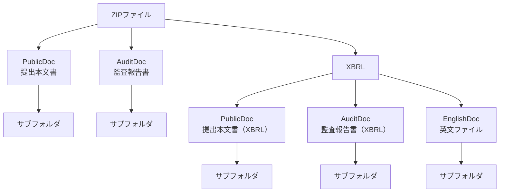
```mermaid
flowchart TB
    ZIP["ZIPファイル"]

    ZIP --> PUBLIC["PublicDoc<br/>提出本文書"]
    PUBLIC --> PUBLIC_SUB["サブフォルダ"]

    ZIP --> AUDIT["AuditDoc<br/>監査報告書"]
    AUDIT --> AUDIT_SUB["サブフォルダ"]

    ZIP --> XBRL["XBRL"]

    XBRL --> XBRL_PUBLIC["PublicDoc<br/>提出本文書（XBRL）"]
    XBRL_PUBLIC --> XBRL_PUBLIC_SUB["サブフォルダ"]

    XBRL --> XBRL_AUDIT["AuditDoc<br/>監査報告書（XBRL）"]
    XBRL_AUDIT --> XBRL_AUDIT_SUB["サブフォルダ"]

    XBRL --> XBRL_ENGLISH["EnglishDoc<br/>英文ファイル"]
    XBRL_ENGLISH --> XBRL_ENGLISH_SUB["サブフォルダ"]
```

| 必要書類（コード値） | 構成図（イメージ） |
| :--- | :--- |
| `PublicDoc` | インライン XBRL を用いる提出書類以外の場合の提出本文書の格納フォルダです。付随ファイルはサブフォルダ内に格納されます。 |
| `AuditDoc` | インライン XBRL を用いる提出書類以外の場合の監査報告書の格納フォルダです。付随ファイルはサブフォルダ内に格納されます。 |
| `XBRL/PublicDoc` | 提出本文書（XBRL 又はインライン XBRL）、マニフェストファイル及びタクソノミファイルの格納フォルダです。付随ファイルはサブフォルダ内に格納されます。 |
| `XBRL/AuditDoc` | 監査報告書（インライン XBRL）、マニフェストファイル及びタクソノミファイルの格納フォルダです。付随ファイルはサブフォルダ内に格納されます。 |
| `XBRL/EnglishDoc` | 英文ファイルの格納フォルダです。付随ファイルはサブフォルダ内に格納されます。 |

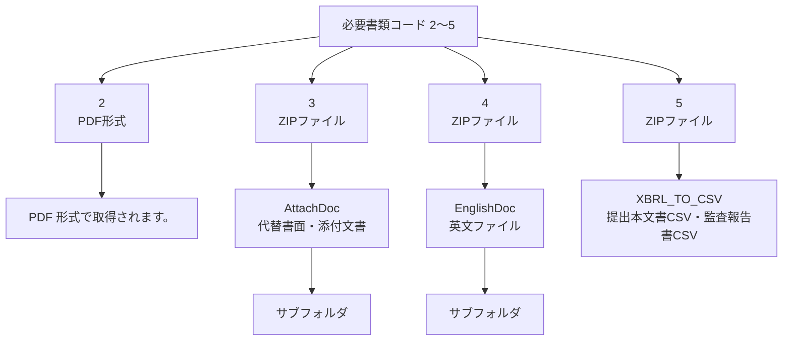
```mermaid
flowchart TB
    ROOT["必要書類コード 2〜5"]

    ROOT --> C2["2<br/>PDF形式"]
    C2 --> PDF["PDF 形式で取得されます。"]

    ROOT --> C3["3<br/>ZIPファイル"]
    C3 --> ATTACH["AttachDoc<br/>代替書面・添付文書"]
    ATTACH --> ATTACH_SUB["サブフォルダ"]

    ROOT --> C4["4<br/>ZIPファイル"]
    C4 --> ENGLISH["EnglishDoc<br/>英文ファイル"]
    ENGLISH --> ENGLISH_SUB["サブフォルダ"]

    ROOT --> C5["5<br/>ZIPファイル"]
    C5 --> CSV["XBRL_TO_CSV<br/>提出本文書CSV・監査報告書CSV"]
```

| 必要書類（コード値） | 構成図（イメージ） |
| :--- | :--- |
| `AttachDoc` | 代替書面・添付文書の格納フォルダです。付随ファイルはサブフォルダ内に格納されます。 |
| `EnglishDoc` | 英文ファイルの格納フォルダです。付随ファイルはサブフォルダ内に格納されます。 |
| `XBRL_TO_CSV` | XBRL_TO_CSV 提出本文書（CSV）及び監査報告書（CSV） (ZIP ファイル)<br>提出本文書及び監査報告書の XBRL ファイルを、CSV 形式に変換したファイルの格納フォルダです。 |

※ 付随ファイルとは、画像及び親フォルダに保存された HTML ファイルからリンクされた HTML ファイルであり、提出時のフォルダ構成で提供されます。

#### CSV ファイルのレイアウト

圧縮ファイルに格納される CSV ファイルの内容については、「『書類閲覧操作ガイド』1 章 EDINET の基本操作 3 共通操作 3-2-1 EDINET からダウンロードできるファイル」を参照してください。

## 3-3 ステータスコード

EDINET API のレスポンスに設定されるステータスコードについて説明します。

EDINET API へのリクエストは、提供される API のエンドポイントの共通部分である `https://api.edinet-fsa.go.jp/api/{バージョン}/` から始まるアクセスを行った場合に、処理を行います。それ以外のアクセスや、EDINET 自体がメンテナンス等を行っている場合は、ブラウザからのアクセスと同様にエラー画面や Sorry 画面を返却します。エラー画面、Sorry 画面又はそもそも通信結果が返ってこないような場合には、EDINET のトップページ又は金融庁ウェブサイトの各種情報検索サービスにてメンテナンス等の情報を確認してください。また、通信経路あるいは EDINET API を利用するプログラムの設定等を再確認してください。

EDINET API へのアクセスを行い、パラメータの誤り等によりエラーとなった場合、レスポンスの出力データは、エラー情報を示す JSON 形式の文字列となります。このとき、レスポンスの HTTP ステータスは "200" となります。

エラー情報を示す JSON 形式の文字列には「ステータス」及び「メッセージ」が出力されます。出力する値の一覧は次のとおりです。

| ステータス | メッセージ | 説明 | 対処方法 |
| :--- | :--- | :--- | :--- |
| 200 | OK | リクエスト成功時（書類一覧 API の成功時に設定される） | － |
| 400 | Bad Request | リクエストデータに問題あり（パラメータの内容や文字コード誤り） | リクエスト内容が誤っています。リクエストの内容（エンドポイント、パラメータの形式等）を見直してください。 |
| 401 | Access denied due to invalid subscription key. Make sure to provide a valid key for an active subscription. | API キーが無効 | API キーが誤っているか、リクエストパラメータに API キーが指定されていません。再度 API キー発行画面に表示されている API キーを確認のうえ、正しい API キーを指定してください。 |
| 404 | Not Found | リソースが存在しない | データが取得できません。リクエストパラメータの指定方法及び設定値を見直してください。 |
| 500 | Internal Server Error | サーバ側での処理中にエラー | EDINET のトップページ又は金融庁ウェブサイトの各種情報検索サービスにてメンテナンス等の情報を確認してください。 |

#### 書類取得 API を利用する際のリクエスト結果の判定について

> [!CAUTION]

書類取得 API は、リクエストの成功/エラーで、レスポンスに出力されるデータの形式がそれぞれ異なります。しかし、レスポンス上は HTTP ステータスが "200"、かつ出力データ内容に何らかのデータが出力されるため、これらの情報だけではエラーを検知することは困難です。

従って書類取得 API では、リクエストの成功/エラーに応じたレスポンスヘッダの "Content-Type" を設定しています。この値を判定することで、レスポンスの出力データ内容がどの形式なのかを機械的に判定することが可能となります。

"Content-Type" の設定値については「3-2-2 レスポンスについてレスポンスヘッダ」を参照してください。

#### エラー情報として出力するデータの内容（サンプル）

> [!NOTE]

リクエストがエラーとなった場合に出力されるデータ内容は次のような構成となります。

##### A) リクエスト結果が "400" (Bad Request), "404" (Not Found), "500" (Internal Server Error) の場合

（サンプル）リクエスト結果が "404" (Not Found) であった場合の出力データ内容

```json
{
  "metadata": {
    "title": "提出された書類を把握するための API",
    "status": "404",
    "message": "Not Found"
  }
}
```

※ 書類一覧 API（メタデータ）のうち、「パラメータ」、「結果セット」及び「書類一覧更新日時」の項目を持たないデータ構成となります。

##### B) リクエスト結果が "401" (Access denied due to invalid subscription key.) であった場合の出力データ内容

```json
{
  "StatusCode": 401,
  "message": "Access denied due to invalid subscription key. Make sure to provide a valid key for an active subscription."
}
```

# 4 章 その他

## 4-1 参考資料

EDINET API が扱う管理番号及びコードに関して説明します。

### EDINET コードリスト、ファンドコードリスト

EDINET コードに紐付く提出者の情報及びファンドコードに紐付くファンドの情報は EDINET 閲覧サイトで取得可能です（トップページの「EDINET タクソノミ及びコードリスト ダウンロード」⇒「EDINET コードリスト」配下の「EDINET コードリスト」及び「ファンドコードリスト」）。

ダウンロードページのリンクは次のとおり：
https://disclosure2.edinet-fsa.go.jp/weee0010.aspx

また、固定リンクを利用する場合は次のリンクを利用してください。

- **EDINET コードリスト**
  - 日本語リスト: https://disclosure2dl.edinet-fsa.go.jp/searchdocument/codelist/Edinetcode.zip
  - 英語リスト: https://disclosure2dl.edinet-fsa.go.jp/searchdocument/codelisteng/Edinetcode.zip
- **ファンドコードリスト**
  - 日本語リスト: https://disclosure2dl.edinet-fsa.go.jp/searchdocument/codelist/Fundcode.zip
  - 英語リスト: https://disclosure2dl.edinet-fsa.go.jp/searchdocument/codelisteng/Fundcode.zip

### 書類管理番号

EDINET で開示書類ごとに付与された一意の番号です。訂正報告書、変更報告書等の関連書類の書類管理番号も親書類から独立に採番されます。

### 親書類管理番号

親書類がある場合の親書類の書類管理番号です。次の書類管理番号が親書類管理番号として設定されます。

- 訂正報告書における、訂正前の書類の書類管理番号（提出操作上設定されている場合のみ）
- 変更報告書における、基となる大量保有報告書や変更報告書（提出操作上設定されている場合のみ）
- 発行登録追補書類における、発行登録書の書類管理番号
- 確認書における、確認対象となる有価証券報告書等
- 公開買付報告書、公開買付撤回届出書、対質問回答報告書、意見表明報告書における、報告対象の公開買付届出書の書類管理番号
- 訂正みなし有価証券届出書に相当する有価証券報告書等における、対象となるみなし有価証券届出書の書類管理番号
- 取下書における、取下げ対象の書類の書類管理番号（「3-1-5 書類の取下げ」参照）

### 府令コード

| コード値 | コード名称 |
| :--- | :--- |
| 010 | 企業内容等の開示に関する内閣府令 |
| 015 | 財務計算に関する書類その他の情報の適正性を確保するための体制に関する内閣府令 |
| 020 | 外国債等の発行者の開示に関する内閣府令 |
| 030 | 特定有価証券の内容等の開示に関する内閣府令 |
| 040 | 発行者以外の者による株券等の公開買付けの開示に関する内閣府令 |
| 050 | 発行者による上場株券等の公開買付けの開示に関する内閣府令 |
| 060 | 株券等の大量保有の状況の開示に関する内閣府令 |

### 様式コード

「別紙 1 様式コードリスト」を参照してください。

### 書類種別コード

| コード値 | コード名称 |
| :--- | :--- |
| 010 | 有価証券通知書 |
| 020 | 変更通知書（有価証券通知書） |
| 030 | 有価証券届出書 |
| 040 | 訂正有価証券届出書 |
| 050 | 届出の取下げ願い |
| 060 | 発行登録通知書 |
| 070 | 変更通知書（発行登録通知書） |
| 080 | 発行登録書 |
| 090 | 訂正発行登録書 |
| 100 | 発行登録追補書類 |
| 110 | 発行登録取下届出書 |
| 120 | 有価証券報告書 |
| 130 | 訂正有価証券報告書 |
| 135 | 確認書 |
| 136 | 訂正確認書 |
| 140 | 四半期報告書 |
| 150 | 訂正四半期報告書 |
| 160 | 半期報告書 |
| 170 | 訂正半期報告書 |
| 180 | 臨時報告書 |
| 190 | 訂正臨時報告書 |
| 200 | 親会社等状況報告書 |
| 210 | 訂正親会社等状況報告書 |
| 220 | 自己株券買付状況報告書 |
| 230 | 訂正自己株券買付状況報告書 |
| 235 | 内部統制報告書 |
| 236 | 訂正内部統制報告書 |
| 240 | 公開買付届出書 |
| 250 | 訂正公開買付届出書 |
| 260 | 公開買付撤回届出書 |
| 270 | 公開買付報告書 |
| 280 | 訂正公開買付報告書 |
| 290 | 意見表明報告書 |
| 300 | 訂正意見表明報告書 |
| 310 | 対質問回答報告書 |
| 320 | 訂正対質問回答報告書 |
| 330 | 別途買付け禁止の特例を受けるための申出書 |
| 340 | 訂正別途買付け禁止の特例を受けるための申出書 |
| 350 | 大量保有報告書 |
| 360 | 訂正大量保有報告書 |
| 370 | 基準日の届出書 |
| 380 | 変更の届出書 |

## 改版履歴

| № | 改版日 | 改版内容 |
| :--- | :--- | :--- |
| 1.0 | 2019.03 | 初版 |
| 1.1 | 2023.05 | システム再構築に伴い、次の記載を変更。<br>・EDINET コードリスト、ファンドコードリストのダウンロード URL を変更。<br>・開示書類の閲覧可能期間の延長に伴い、書類一覧 API で指定可能な時期等を 5 年から 10 年に変更。<br>・サポートする暗号化通信について、TLS バージョンを 1.2 に変更。<br>・「2-1-2-2 書類一覧 API（提出書類一覧及びメタデータ）」の NOTE「書類一覧 API（提出書類一覧及びメタデータ）の出力するデータの内容（サンプル）」及び「2-1-7 財務局職員による書類の不開示」の出力データの内容（サンプル）の periodStart と periodEnd の値を修正。 |
| 2.0 | 2023.08 | バージョン 2 への改版に伴い次の記載を追加：<br>・「1-2-2 EDINET API で取得対象となるデータの範囲」を追加。<br>・「2 章 API の利用準備」を追加。<br>・「3-1 書類一覧 API」、「3-2 書類取得 API」の「リクエストパラメータ」に「API キー」を追加。<br>・「3-1-2-2 書類一覧 API（提出書類一覧及びメタデータ）」の「出力データ内容」に「CSV 有無フラグ」、「縦覧区分」を追加。<br>・「3-2 書類取得 API」で取得可能なデータに「CSV」を追加。 |
| 2.1 | 2024.03 | ・「1-2-2 EDINET API で取得対象となるデータの範囲」の「延長期間」の表から「臨時報告書」を削除し、「半期報告書」を追加。半期報告書は 2024 年 4 月 1 日以降に提出される書類から延長の対象となる旨、注意「延長期間について」に説明を追記。<br>・「3-1-5 書類の取下げ」について、2024 年 4 月 1 日以後提出される発行登録書は取下げ後も開示されるため、説明から「非開示のため」を削除。 |
| 2.2 | 2024.07 | ・「3-1-1 リクエストについて」および「3-2-1 リクエストについて」の HTTP 通信方式に記載のサポートする暗号化通信について、TLS バージョンを 1.2 以上に変更。 |
| 2.3 | 2025.04 | ・「2 章 API の利用準備」に「2-1 利用環境について」を追加。また、追加に伴い、2 章の項番を変更。 |
| 2.4 | 2025.06 | ・「3-1-1 リクエストについて」及び「3-2-1 リクエストについて」において、リクエスト URL を追記。<br>・「3-3 ステータスコード」の表において、ステータス 401 の対処方法に API キーが指定されていない旨を追記。<br>・「3-3 ステータスコード」の表において、ステータス 404 の対処方法にリクエストパラメータの指定方法を見直す旨を追記。 |
| 2.5 | 2025.10 | ・Microsoft Windows 10 のサポート終了に伴い、「2-2-1 ポップアップブロックの許可」について、Microsoft Edge 起動の手順を更新。 |
| 2.6 | 2026.01 | ・「2-3-1-2 アカウントの作成」において、「ユーザーの詳細」画面、「確認コードの送信」手順の変更及び説明の追記。 |
| 2.7 | 2026.04 | 次の記載にサインイン表示方法の修正とキャプチャを追加：<br>・「2-3-1-1 サインイン画面の表示」<br>・「2-3-2-2 連絡先の変更及び API キーの再発行」<br>・「2-3-2-4 パスワードの再発行」<br>・「2-3-2-5 多要素認証のクリア」 |

